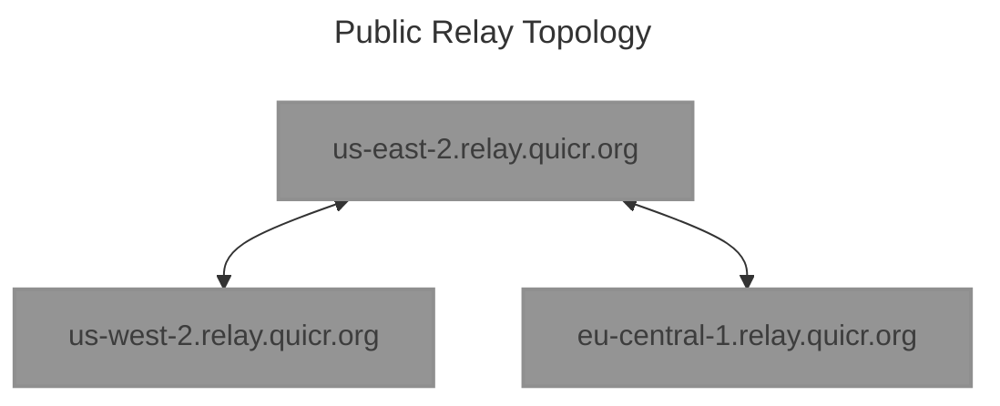

# LAPS: Media over QUIC Transport (MOQT) Relay

LAPS, the Latency Aware Publish/Subscribe relay, is a [Media over QUIC Transport (MOQT)](https://github.com/moq-wg/moq-transport/) relay for low-latency publish/subscribe media delivery. It accepts MOQT publisher and subscriber client connections and forwards media tracks through a distributed relay network.

Also known as: MoQ relay, MOQT relay, Media over QUIC relay, Media over QUIC Transport relay, low-latency media relay.

## What Is LAPS?

LAPS implements MOQT relay behavior for publishers and subscribers and adds relay-to-relay peering for distributed media fan-out. The relay peering architecture can run as a simple mesh, or it can scale to large infrastructure by using Edge, Via, and Stub relay roles to build efficient forwarding paths between publishers and subscribers.

[Relay protocol peering](docs/relay-protocol.md) uses a LAPS-specific protocol between relays rather than MOQT itself. This peering layer provides low-latency data forwarding, traffic engineering, and policy-aware relay selection for global deployments. The current MOQT draft support is tied to the active branch and bundled `dependencies/libquicr` revision.

## MOQT Relay Features

- Media over QUIC Transport (MOQT) relay support for publisher and subscriber client connections
- Low-latency publish/subscribe forwarding for media tracks and namespaces
- Relay-to-relay peering for distributed MOQT deployments
- Edge, Via, and Stub relay roles for different positions in the network
- Control peering and data peering modes for separating signaling from media forwarding
- On-demand Via relay aggregation for bandwidth-efficient fan-out between Edge relays
- Source-routed data forwarding with Subscribe Node Set (SNS) advertisements
- Track ranking for selecting top tracks from subscribed namespaces
- Docker images and a `relay_health_check` probe for monitoring a LAPS relay or another MOQT relay

## Relay Peering At Scale

LAPS peering is designed to solve relay-to-relay connectivity at scale. Edge relays accept MOQT client sessions and can act as origin relays, subscriber relays, or Via relays. Via relays aggregate traffic between Edge relays without carrying all publisher and subscriber state, reducing bandwidth and connection pressure during fan-out. Stub relays provide lightweight local fan-out behind NAT or firewall boundaries while the connected Edge relay represents them to the wider relay network.

The peering selection algorithm can use direct hub-and-spoke forwarding when it is the best path, or inject Via relays when aggregation, congestion avoidance, alternate IP forwarding paths, regional constraints, or administrative policy call for it. Control peering distributes node, publish, and subscribe information bases; data peering forwards MOQT objects in a pipeline-friendly format with low encapsulation overhead.

### Slack

Join the `#laps` channel on [quicdev Slack](https://quicdev.slack.com) to connect with developers and contributors of LAPS.
 
> [!NOTE]
> Access to the quicdev Slack workspace requires an invitation.
> To request an invite, please follow the instructions under "Implementing QUIC" on quicwg.org.

## MOQT Developer Playground

A developer playground for interoperability testing with Media over QUIC Transport (MOQT) applications.

**Specifications:**
- **Maintenance Window:** Daily restart at 00:01 UTC
- **Instance:** AWS `t4g.micro` (2 vCPUs, 1GB RAM)
- **Transport:** Native QUIC on port `33437`

### Use Case & Limitations

**Intended for:**
- MOQT application development and interop testing
- Protocol compliance verification

**Not suitable for:**
- Performance/stress testing
- Production workloads
- Relay-to-relay protocol development

> [!IMPORTANT]
> For relay implementation discussions, contact the team via Slack. See [relay-protocol documentation](docs/relay-protocol.md).

### Network Topology



**Architecture:**
Flat mesh topology with full peering between nodes. Additional regions available upon request.
 
**Endpoints:**
 
| Region	| URL |
| ------ | --- |
| Anycast (recommended) | moq://relay.quicr.org:33437 |
| US West (Oregon) | moq://us-west-2.relay.quicr.org:33437 |
| US East (Ohio) | moq://us-east-2.relay.quicr.org:33437 |
| EU Central (Frankfurt) | moq://eu-central-1.relay.quicr.org:33437 |
 
> [!TIP]
> Use anycast endpoint for automatic region selection. Use region-specific endpoints for testing cross-region behavior.


## Development

### Version
Version is defined in [CMakeLists.txt](CMakeLists.txt) under the **project** command for ```laps```.
In code, the ```version_config.h``` file is generated. Each binary, library and docker container tag will have
this version. 

The last octet of the version should be incremented on any change, unless it's the first version (zero) of a
```major.minor``` change. 

## Build

> **MacOS** command line tools are required. If you get errors on a Mac, run the below.
```
xcode-select --install
```

```
make build
```

This experimental branch builds MsQuic support and selects it by default. Point CMake at an installed MsQuic
package when configuring:

```
cmake -S . -B build -DCMAKE_PREFIX_PATH=/path/to/msquic/install
cmake --build build --parallel 8
```

Use `--transport picoquic` to run the same binary with picoquic instead. The accepted values are `msquic` and
`picoquic`.

### Running tests

Run relay:

```
make cert
cd build/src

./lapsRelay
```

## Relay Health Check

The `relay_health_check` program can be used to monitor `lapsRelay`, or any other MOQT relay that supports the
same publish/subscribe behavior. The probe connects as both a publisher and subscriber, publishes a small object,
and verifies that the subscriber receives the same payload.

Build the local binary with:

```
make build
```

Run the probe directly:

```
./build/src/relay_health_check \
  --uri moq://laps-relay:12345/relay \
  --timeout-ms 5000 \
  --namespace libquicr/health \
  --message "libquicr relay health check"
```

The same settings can be supplied with environment variables:

```
LIBQUICR_RELAY_HEALTH_URI=moq://laps-relay:12345/relay \
LIBQUICR_RELAY_HEALTH_TIMEOUT_MS=5000 \
LIBQUICR_RELAY_HEALTH_NAMESPACE=libquicr/health \
LIBQUICR_RELAY_HEALTH_MESSAGE="libquicr relay health check" \
./build/src/relay_health_check
```

The probe prints `ok` on success. On failure it prints `error`; additional failure details are written after that.

### Health Check Docker Image

The `healthcheck.Dockerfile` image runs an HTTP wrapper around `relay_health_check`. A plain HTTP `GET` returns:

```
ok
```

or, if the probe fails:

```
error

<details>
```

Build health-check images with:

```
make image-healthcheck-amd64
make image-healthcheck-arm64
```

Run the HTTP health-check container:

```
docker run --rm -p 8080:8080 \
  -e LIBQUICR_RELAY_HEALTH_URI=moq://laps-relay:12345/relay \
  quicr/healthcheck:<version>-amd64
```

Check it with:

```
curl http://localhost:8080/
```

## Build with Docker

To build an image, make sure to have docker running. 

**amd64 image**

```make image-amd64```

**arm64 image**

```make image-arm64```

### Build debian using clang only

Laps can be built using clang/llvm only.  Review [debian.clang.Dockerfile](debian.clang.Dockerfile) for
details on how to build using debian bookworm with clang/llvm only.

### Notes on docker build
#### **MUST** run ```git submodule ...``` **BEFORE BUILD**

Before running the docker build, you **MUST** first run the below to update the dependencies.
*This cannot be performed during the docker build process due to the use of **private repos**.*

```
git submodule update --init --recursive
```


## Run with Docker

On Intel:
```
docker run --rm -it laps-amd64:latest /bin/bash 
```

On Mac silicon:
```
docker run --rm -it laps-arm64:latest /bin/bash 
```

--- 
## Build laps and Publish to ECR

### Build - amd64

```
make image-amd64
```

### Push Image
> **NOTE**: you can use [duo-sso cli](https://wiki.cisco.com/display/THEEND/AWS+SAML+Setup) to get
> an API KEY/SECRET using your CEC login to AWS.  Length of duration needs to be 3600 seconds or less.

The below will login to ECR, TAG the image build in the previous step and finally push it. 

```
export AWS_ACCESS_KEY_ID=<your key id>
export AWS_SECRET_ACCESS_KEY=<your secret key>

make publish-image
```

---
## Build Raspberry PI Image
The current build supports Raspberry Pi **Debian Lite Bookworm**   

### (1) Install 64bit OS Lite Debian Bookworm 
Follow the PI imager instructions at https://www.raspberrypi.com/software/ to install base image. 

### (2) Install/Load the image on Raspberry Pi SD card
Remove the Pi SD card and put it into a reader that you can use to copy the image from your laptop/desktop.

> [!WARNING]
> Before performing the below, backup your existing data on the raspberry Pi if needed.

> [!NOTE]
> The below normally takes less than 15 minutes 

1. Power off your existing raspberry Pi and eject the SD card
2. Connect the SD card to laptop/desktop
3. Run **"Raspberry Pi Imager"**
4. Click "CHOOSE DEVICE" and select your Raspberry Pi version of 3, 4 or 5"
4. Click "CHOOSE OS"
5. In popup, select "**Raspberry Pi OS (other)**"
6. Scroll down to and select on "**Raspberry Pi OS Lite (64-bit)**"
7. Clock on "CHOOSE STORAGE"
8. Click in the bottom right settings icon
   1. Select and set the **hostname** to something unique to you
   2. Select "Enable SSH"
   3. Select "Use password authentication"
   4. Select and set username and password
   5. Scroll down and select and set locale settings
   6. Click "**SAVE**"
9. Click "**WRITE**"
   1. Select "YES" if prompted to apply image customization settings
   2. Select "YES" to erase the current SD disk.
10. The disk should be ejected and put back into the raspberry pi 
11. Power on the raspberry Pi. It will use DHCP with SSH enabled. 

> [!NOTE]
> The raspberry Pi will use DHCP to get an IP address via the wired connection. 
> MDNS can be used to access the device using the **hostname** you configured.
> For example, my hostname is set to "tievens-pi" using
> the mdns name `ssh pi@tievens-pi.local`
 

### (3) Creating the binary image

#### Using docker

You will need docker installed to run the below. 

```
make image-pi
```

#### Native build on Pi

##### One-time setup for your Pi
After you have build/installed your Pi, you will need to SSH to it and run the below to setup the build
environment. 

###### (a) APT install dependencies

```
sudo apt-get update
sudo apt-get install -y make cmake openssl golang wget git ca-certificates
```

###### (b) Get laps from Github

> [!IMPORTANT]
> Create a key so that you can then update your github account with this key. This is required since laps and
> some of the submoudules are private repos.

```
# Hit enter through the prompts
ssh-keygen

cat ~/.ssh/<output_of_ssh-keygen>.pub
```

Goto github, under **settings**, then under **SSH and GPG keys**, add a new SSH key with the contents of the above
output of the `<output_of_ssh-keygen>.pub`.  

Clone laps 

```
git clone git@github.com:Quicr/laps.git
```

###### (c) Sync laps repo 

> [!WARNING]
> Run the below initially and before doing builds to make sure you have all submodules and latest code
```
git pull
git submodule update --init --recursive
```

###### (d) Build the image

```
# optionally do the below
make cclean 

# Build
export  CFLAGS="-Wno-error=stringop-overflow"
export  CXXFLAGS="-Wno-error=stringop-overflow"

BUILD_JOBS=3 make build 
```

### (4) Copy the latest install-relay.sh script and binary to Pi

The docker built binary will be created as `./build-pi/lapsRelay`
The natively built binary will be created as `./build/lapsRelay`

Copy the image:

```
scp ./build-pi/lapsRelay <user>@<ip or hostname.local>:
```

> [!IMPORTANT]
> Before or after copying the **install-relay.sh** script, you **SHOULD**
> edit the file and update the `Environment=<var=value>` lines based on your config/deployment.
> The defaults should work, but you might need to update them. 

Copy the `install-relay.sh` script:

```
scp ./scripts/install-relay.sh <user>@<ip or hostname.local>:
```

### (5) Run the install-relay script
The install-relay script will install or upgrade existing laps relay. 

> [!NOTE]
> You will be prompted for your password to run `sudo` comments.


```
bash ~/install-relay.sh
```

Example:

```
tim@raspberrypi:~ $ bash install-relay.sh
Shutting down lapsRelay
Updating systemd unit file /etc/systemd/system/laps.service
Copying ~/lapsRelay to /usr/local/laps/lapsRelay
● laps.service - Latency Aware Publish Subscriber (LAPS) relay
     Loaded: loaded (/etc/systemd/system/laps.service; disabled; vendor preset: enabled)
     Active: active (running) since Fri 2024-01-26 16:20:12 PST; 101ms ago
       Docs: https://github.com/quicr/laps
   Main PID: 147676 (lapsRelay)
      Tasks: 12 (limit: 779)
        CPU: 50ms
     CGroup: /system.slice/laps.service
             └─147676 /usr/local/laps/lapsRelay

Jan 26 16:20:12 raspberrypi lapsRelay[147676]: 2024-01-26T16:20:12.669225 [DEBUG] [PMGR] [QUIC] packet_loop_port_update
Jan 26 16:20:12 raspberrypi lapsRelay[147676]: 2024-01-26T16:20:12.670094 [INFO] [PMGR] [QUIC] Starting transport callback notifier thread
Jan 26 16:20:12 raspberrypi lapsRelay[147676]: 2024-01-26T16:20:12.676149 [INFO] [PEER] [QUIC] Setting idle timeout to 30000ms
Jan 26 16:20:12 raspberrypi lapsRelay[147676]: 2024-01-26T16:20:12.676290 [INFO] [PEER] [QUIC] Setting wifi shadow RTT to 1us
Jan 26 16:20:12 raspberrypi lapsRelay[147676]: 2024-01-26T16:20:12.677026 [INFO] [PEER] [QUIC] Connecting to server relay.us-west-2.quicr.ctgpoc.com:33439
Jan 26 16:20:12 raspberrypi lapsRelay[147676]: 2024-01-26T16:20:12.677423 [INFO] [PEER] [QUIC] Starting transport callback notifier thread
Jan 26 16:20:12 raspberrypi lapsRelay[147676]: 2024-01-26T16:20:12.745799 [INFO] [PEER] [QUIC] Created new connection context for conn_id: 367620619648
Jan 26 16:20:12 raspberrypi lapsRelay[147676]: 2024-01-26T16:20:12.746410 [INFO] [PEER] [QUIC] conn_id: 367620619648 data_ctx_id: 1 create new stream with stream_id: 6
Jan 26 16:20:12 raspberrypi lapsRelay[147676]: 2024-01-26T16:20:12.746557 [INFO] [PEER] Control stream ID 1
Jan 26 16:20:12 raspberrypi lapsRelay[147676]: 2024-01-26T16:20:12.746769 [INFO] [CMGR] Starting client manager id 33435

RUN 'systemctl status laps.service' to get status of service
RUN 'journalctl -u laps.service -f' to tail laps relay log
```

--- 

## Discovery using mDNS

See [docs/discovery.md](docs/discovery.md) for details on how to setup and use mDNS
