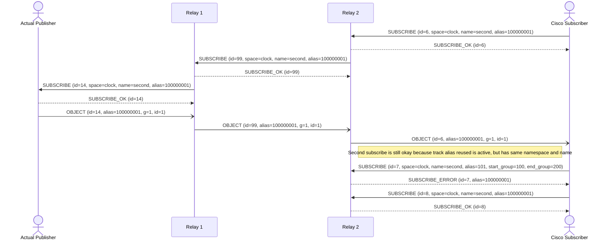
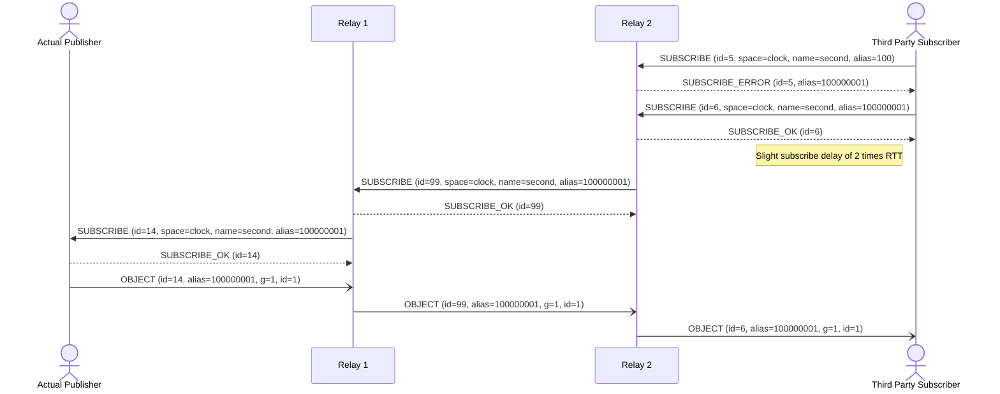
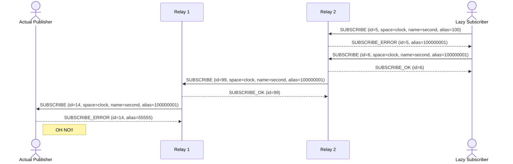
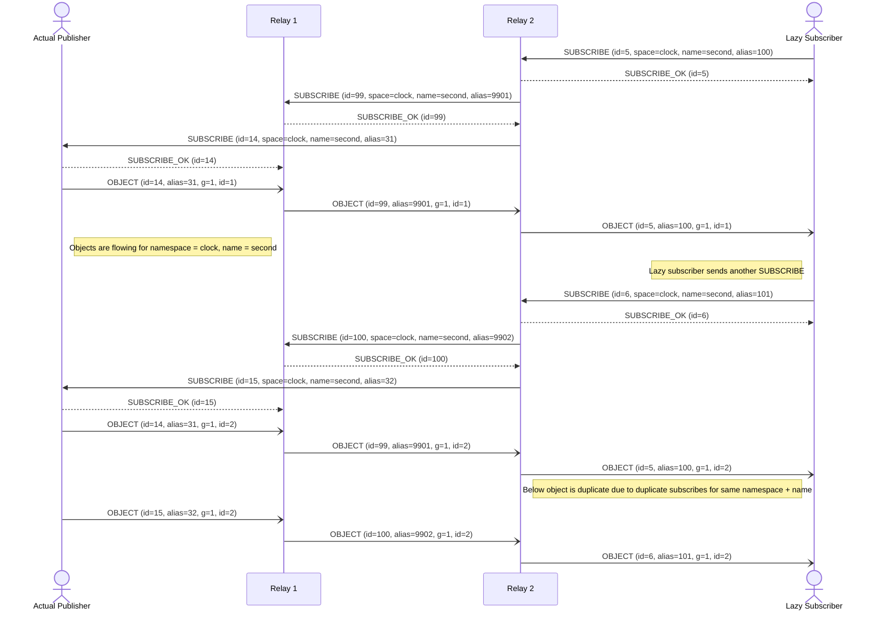

### Change to for Our Client

```mermaid
sequenceDiagram
    actor P as Actual Publisher
    participant R1 as Relay 1
    participant R2 as Relay 2
    actor S as Cisco Subscriber

    S ->>R2: SUBSCRIBE (id=6, space=clock, name=second, alias=100000001)
    R2-->>S: SUBSCRIBE_OK (id=6)
    R2 ->>R1:  SUBSCRIBE (id=99, space=clock, name=second, alias=100000001)
    R1 -->>R2: SUBSCRIBE_OK (id=99)
    R1 ->>P:  SUBSCRIBE (id=14, space=clock, name=second, alias=100000001)
    P -->>R1: SUBSCRIBE_OK (id=14)
    P -) R1: OBJECT (id=14, alias=100000001, g=1, id=1)
    R1 -)R2: OBJECT (id=99, alias=100000001,  g=1, id=1)
    R2 -)S: OBJECT (id=6, alias=100000001, g=1, id=1)

    Note left of S: Second subscribe is still okay because track alias reused is active, but has same namespace and name
    S ->>R2: SUBSCRIBE (id=7, space=clock, name=second, alias=101, start_group=100, end_group=200)
    R2-->>S: SUBSCRIBE_ERROR (id=7, alias=100000001)
    S ->>R2: SUBSCRIBE (id=8, space=clock, name=second, alias=100000001)
    R2-->>S: SUBSCRIBE_OK (id=8)

```

### Change to for third party

```mermaid
sequenceDiagram
    actor P as Actual Publisher
    participant R1 as Relay 1
    participant R2 as Relay 2
    actor S as Third Party Subscriber

    S ->>R2: SUBSCRIBE (id=5, space=clock, name=second, alias=100)
    R2-->>S: SUBSCRIBE_ERROR (id=5, alias=100000001)
    S ->>R2: SUBSCRIBE (id=6, space=clock, name=second, alias=100000001)
    R2-->>S: SUBSCRIBE_OK (id=6)
    Note left of S: Slight subscribe delay of 2 times RTT
    R2 ->>R1:  SUBSCRIBE (id=99, space=clock, name=second, alias=100000001)
    R1 -->>R2: SUBSCRIBE_OK (id=99)
    R1 ->>P:  SUBSCRIBE (id=14, space=clock, name=second, alias=100000001)
    P -->>R1: SUBSCRIBE_OK (id=14)
    P -) R1: OBJECT (id=14, alias=100000001, g=1, id=1)
    R1 -)R2: OBJECT (id=99, alias=100000001,  g=1, id=1)
    R2 -)S: OBJECT (id=6, alias=100000001, g=1, id=1)

```

### Possible problem

```mermaid
sequenceDiagram
    actor P as Actual Publisher
    participant R1 as Relay 1
    participant R2 as Relay 2
    actor S as Lazy Subscriber

    S ->>R2: SUBSCRIBE (id=5, space=clock, name=second, alias=100)
    R2-->>S: SUBSCRIBE_ERROR (id=5, alias=100000001)
    S ->>R2: SUBSCRIBE (id=6, space=clock, name=second, alias=100000001)
    R2-->>S: SUBSCRIBE_OK (id=6)
    R2 ->>R1:  SUBSCRIBE (id=99, space=clock, name=second, alias=100000001)
    R1 -->>R2: SUBSCRIBE_OK (id=99)
    R1 ->>P:  SUBSCRIBE (id=14, space=clock, name=second, alias=100000001)
    P -->>R1: SUBSCRIBE_ERROR (id=14, alias=55555)
    Note right of P: OH NO!! 
```

---

### What MOQT supports and could result in the below

```mermaid
sequenceDiagram
    actor P as Actual Publisher
    participant R1 as Relay 1
    participant R2 as Relay 2
    actor S as Lazy Subscriber

    S ->>R2: SUBSCRIBE (id=5, space=clock, name=second, alias=100)
    R2-->>S: SUBSCRIBE_OK (id=5)
    R2 ->>R1:  SUBSCRIBE (id=99, space=clock, name=second, alias=9901)
    R1 -->>R2: SUBSCRIBE_OK (id=99)
    R2 ->>P:  SUBSCRIBE (id=14, space=clock, name=second, alias=31)
    P -->>R1: SUBSCRIBE_OK (id=14)
    P -) R1: OBJECT (id=14, alias=31, g=1, id=1)
    R1 -)R2: OBJECT (id=99, alias=9901,  g=1, id=1)
    R2 -)S: OBJECT (id=5, alias=100, g=1, id=1)
    Note right of P: Objects are flowing for namespace = clock, name = second
    Note left of S: Lazy subscriber sends another SUBSCRIBE

    S ->>R2: SUBSCRIBE (id=6, space=clock, name=second, alias=101)
    R2-->>S: SUBSCRIBE_OK (id=6)
    R2 ->>R1:  SUBSCRIBE (id=100, space=clock, name=second, alias=9902)
    R1 -->>R2: SUBSCRIBE_OK (id=100)
    R2 ->>P:  SUBSCRIBE (id=15, space=clock, name=second, alias=32)
    P -->>R1: SUBSCRIBE_OK (id=15)


    P -) R1: OBJECT (id=14, alias=31, g=1, id=2)
    R1 -)R2: OBJECT (id=99, alias=9901,  g=1, id=2)
    R2 -)S: OBJECT (id=5, alias=100, g=1, id=2)

   Note left of S: Below object is duplicate due to duplicate subscribes for same namespace + name

    P -) R1: OBJECT (id=15, alias=32, g=1, id=2)
    R1 -)R2: OBJECT (id=100, alias=9902,  g=1, id=2)
    R2 -)S: OBJECT (id=6, alias=101, g=1, id=2)
```