# LAPS Peering Protocol and Architecture

LAPS peering architecture enables peering between relays and clients supporting granular traffic engineering and optimizations. Peering can be simple mesh style or it can be highly scalable for a large infrastructure by using
 on-demand Via peering sessions to aggregate traffic flows in the most efficient way to provide low loss/latency
fan-out delivery.

Peering sessions support administrative policy constraints to ensure that traffic is
forwarded via a traffic engineered path using one or more relays in the network. Traffic engineered paths
can be human or AI defined to provide low duplication and even load distribution
while maintaining administrative policies.  For example, AI can optimize relay forwarding to support different classes
of service (e.g., gold, silver, bronze) while also supporting geographic region constraints. IP forwarding paths 
are a factor in maintaining administrative policies. For example, if forwarding between relay A in New York to
relay B in Seattle would IP packet forward via Canada, AI would find another relay to ensure IP forwarding
path compliance with the administrative policy. 

Peering scales to a global network of relays supporting scale into hundreds of millions of active
tracks with any combination of publishers and subscribers.

## Relay Types

The relay type is configured upon start of the relay process. A relay can change its type at runtime, but it must
disconnect all peers and reconnect them to synchronize the type. The relay type is advertised in [node information](#node-information) upon connection establishment. 

Not all relays need to perform the same functions. There are also specific use-cases for relays based on their
position in the topology and how they are used. 

Relays are *therefore* categorized into the following types:

### Via

A Via relay is used by Edge relays to forward data between other Edge relays. A Via relay is an intermediate relay that
does not participate in all the [Information Base](#information-bases) exchanges. Specifically, it only needs to participate in node information base exchanges. 

These relays have high vertical scale due to the lower number of QUIC connections between other Edge/Via relays and because
of [source routing](#source-routing) and no MoQT client connections. 

> [!NOTE]
> A Via is not intended to be burdened by the global state of subscriptions... but a Via can be configured
> to reflect [subscribe information](#subscribe-information) when [control peering](#1-control-peering) servers are not used or available. The Via in this case merely stores and propagates subscriptions. 

**Via relay operations:**

- Does not need to be part of the `announce` and `subscribe` advertisements and withdrawals selection
  for data-plane forwarding
- It participates in the `node` advertisements and withdrawals to maintain reachability information to all nodes.
- `announce` and `subscribe` advertisements/withdrawals are state maintained, but only to prevent looping and
  duplication. The retention for this state is set to the maximum convergence time. In this sense, it is a cache
  of seen announces and subscribes in the last several seconds.
- Forwards data streams and datagram objects based on [source routing](#source-routing) using the node information base.
- Traditionally has high vertical scale to support large number of tracks and bandwidth
- Strategically placed geographically near Edge relays to provide an aggregation point for fan-out of many Edge relays.
- Used by Edge relays to form a topology to a set of subscriber relays

Peering can go directly to Via or other Edge relays, depending on the [selection algorithm](#selection-algorithm),
which takes into account load, path RTT, path loss, bandwidth, administrative/business policies, etc.

### Edge

Edge relays are core relays that facilitate connections from clients and all [relay types](#relay-types). The Edge
relay is a "**can do it all relay.**"

These relays often have a lower vertical scale due to them having to maintain MoQT client connections.  It 
is expected that there will be many edge relays based on MoQT client connections and bandwidth. 

**Edge relay operations:**

- Performs everything a Via relay does.
- Client connection server implementation of MoQT.
- Handle several client connections, each of which have different QUIC transport encryption/decryption with varying
  high volume of stream changes based on group and subgroups as defined in MoQT.
- Establishes data forwarding-plane to all subscribers based on subscribes and publisher announcements/connections.
- Perform authorization validation and enforcement
- Enforces administrative policy.
- Perform edge defense with client connections by implementing rate limiting and other DoS mitigations
- On-demand peering based on [selection algorithm](#selection-algorithm) to bring in Via relays to establish
  an optimized and efficient data forwarding-plane to subscribers. 
- Receives and state maintains announcements from both MoQT client publishers and Stub relays.

Edge relays are expected to scale horizontally in a stateless fashion, supporting scale up and scale down based
on demand in the region. Edge relays can be "right-sized" to fit the need of subscriber and publisher demand.

Edges relays are often placed behind network load balancers, which can support **anycast** for both client
and peering connections.

### Stub

Stub relays are intended to be super lightweight and simple relays. They connect to one or more Edge relays only
and do not accept inbound connections. They implement MoQT server functionality to accept client connections and
to establish a data forwarding-plane for them via the relay infrastructure. A Stub relay is a **child** of
the **Edge** relay that it is connected to. 

Primary use-case for a Stub relay is to fan-out subscribers in a local area network. Example placement for Stub
relays are in residential access routers, branch offices, NAT routers, access points, floor switches, firewalls, etc. 

> [!NOTE]
> While this protocol fully supports [MoQT](https://github.com/moq-wg/moq-transport/) client connections and
> features of MoQT, it does not require publisher and subscribing clients to use MoQT. Clients can implement this
> protocol as a Stub relay. In this sense, the client is a stub relay of only one client (publisher, subscriber
> or both). 
> There are some interesting use-cases where this could be implemented on a client as a different process
> Stub relay that could efficiently optimize and aggregate multiple applications running on the same host system.
> For example, if many applications  use the Pub/Sub model and need to connect to the relay infrastructure,
> they could use this protocol as a Stub relay to aggregate those applications. 

Stub relays have the following uses, feature capabilities and restrictions:

- Must peer directly with Edge relays
- Can peer to more than one edge relay
- Will only receive subscribes based on the advertised announcements to the Edge relay
- Uses very little memory and CPU for peering
- Use-case for more than one peer is to optimize reachability to other edges
- Fully supports NAT and return traffic over the established peer connection, can be placed behind a firewall/NAT router
- Uses peer mode `Both`, control and data via the same peer connection.
- It does not connect to a cloud provider control server (not needed)
- Will not accept inbound peer connections and will not implement the full peering protocol
- The Edge relay that the Stub connects to will forward subscribes by marking itself as the source
  node. Stubs are transparent and stateless. Only the Edge relay is aware of the Stub. Other Edge and Via relays
  are unaware of Stub relays.

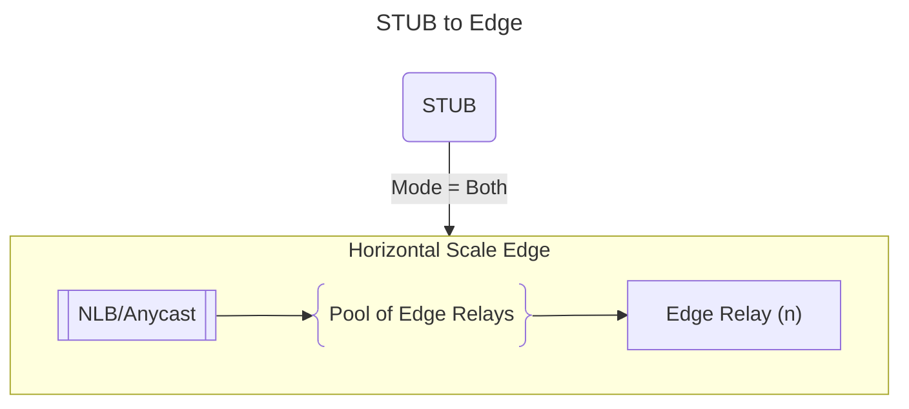

In the above diagram, the Stub is the **child** relay and the Edge relay is the **parent**. All subscriptions
sent by the Stub will be regenerated by the Edge relay with itself as the originator of that subscription.
In this sense, the Edge relay appears to the rest of the Relay network as the relay that has the subscriber.
**This is by design to ensure that the Stub relays, which may be in the millions, do not need to be known by
any other relay in the relay network.**

### Relay Terms

In addition to [relay types](#relay-types), relays are described using additional terms.  This section describes
the terms commonly used to describe relays. 

#### o-relay = Origin Relay

The origin relay node is always an [Edge Relay](#edge) **type**.  When a client session sends a publish
announcement (aka intent to publish), the relay becomes an origin relay. Client connections are only
accepted on Edge and Stub relay types. 

A [Stub Relay](#stub) **type** can have one or more publishers, which technically means the stub is
an origin relay, but the design of this protocol has Stub relays as a child of an Edge relay. The
Edge relay that the stub is connected to becomes the o-relay for the publisher in the data
forwarding-plane topology. 
 
#### s-relay = Subscriber Relay

The subscriber relay node is always an [Edge Relay](#edge) **type**.  When a client session subscribes,
the relay becomes the subscriber relay. Client connections are only accepted on Edge and Stub relay types. 

A [Stub Relay](#stub) **type** can have one or more subscribers, which technically means the stub is
a subscriber relay, but the design of this protocol has Stub relays as a child of an Edge relay. The
Edge relay that the stub is connected to becomes the s-relay for the subscriber in the data forwarding-plane topology. 

#### e-relay = General edge relay

An edge relay is of **type** [Edge](#edge). It implements MoQT and accepts inbound client connections as well as implement peering to act as a Via relay. Edge relays can peer with each other, with STUBs and Via relays.  An edge relay is
a do all relay. The term e-relay is a general term for an edge relay that may be an o-relay, s-relay, or acting
as a Via. 

#### v-relay = Via relay

A via relay is a relay that of **type** [Via](#via). It implements peering but not client access. A Via relay is
intended to be an aggregator (reduce bandwidth by optimized fan-out) and hairpin for traffic steering. It's lightweight
and has higher vertical scale supporting very low latency. 

#### Node

Relay could be implemented in a client, such as a Stub relay in the client. In this case, the client relay would not be called a node.  Node term is used to clarify that the relay of any type is an infrastructure level relay that participates
in peering. 

## Topologies

There are numerous topology options to form the data forwarding-plane from publisher to one or more subscribers.
The general rule of thumb is to optimize with hub-and-spoke (aka Star) peering if possible and inject Via 
relays as and where needed to aggregate efficiently to reduce congestion/bandwidth.  Injecting Via relays are used
to steer data forwarding via different IP forwarding paths to avoid and workaround problems (e.g.,
congestion, loss, high cost path, ...). They are also injected to steer data forwarding based on
administrative policy. By utilizing both Edge and Via relays, data forwarding paths can be granularly
controlled to provide highly scalable efficient low latency-loss between publisher and subscriber(s). 

### Hub-and-Spoke Topology

A hub-and-spoke (star) topology provides a simple data forwarding-plane that often results in the lowest
latency between publisher and subscribers. The design is simple; the relay that has the directly attached
publisher client session sending data (aka origin of the data) establishes peering to relays that directly have
the subscribers connected. 

The [selection algorithm](#selection-algorithm) attempts to use hub-and-spoke if all the below are true:

* Administrative policy permits it
* Network path has enough bandwidth and has little to no loss and acceptable latency
* Publish origin relay is not overloaded with connections to other edges
* Duplication fan-out is not more than configured maximum with a default of 2

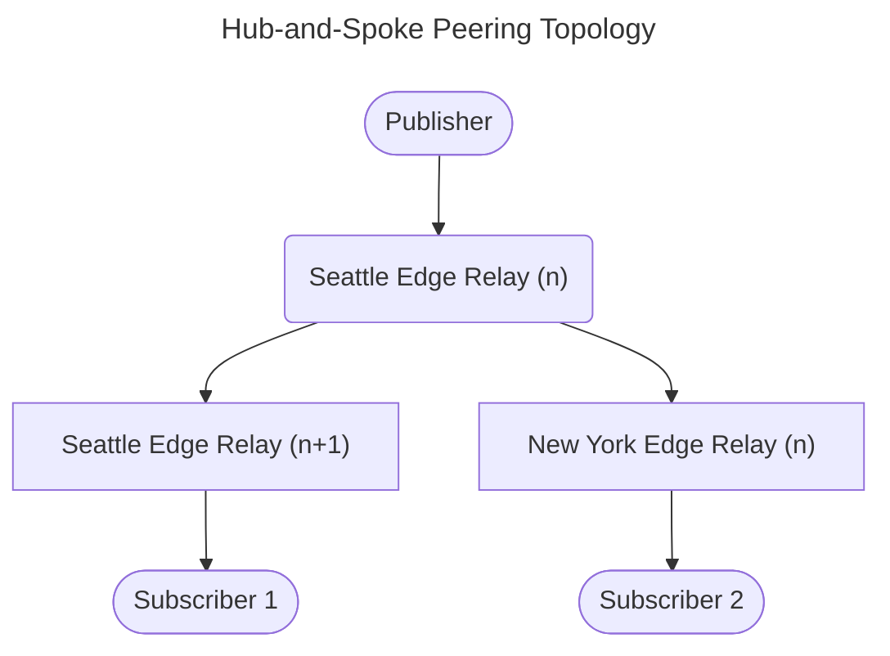

In the above diagram, there are two subscribers in different regions, so aggregation using a Via relay is not needed.
The seattle origin relay establishes peering to the subscriber relay and forwards data. 

### Typical Topology

The typical topology is used to support optimized data forwarding with bandwidth and network forwarding efficiency. It uses
hub-and-spoke when it make sense and adds Via(s) when needed. Via relays are a resource that is engaged on-demand or via predefined peering to establish hairpin/aggregation points in an optimized fashion. The Via(s) that are used are ones that are not overloaded and have optimal forwarding to the target subscriber edge relays. 
A Via is added upon [selection](#selection-algorithm) of peering to establish the data forwarding.  Vias can be
added or removed with zero-loss in data forwarding. For example, the data forwarding-plane may start off as
hub-and-spoke and then transition to use a Via to aggregate e-relays in a region. 

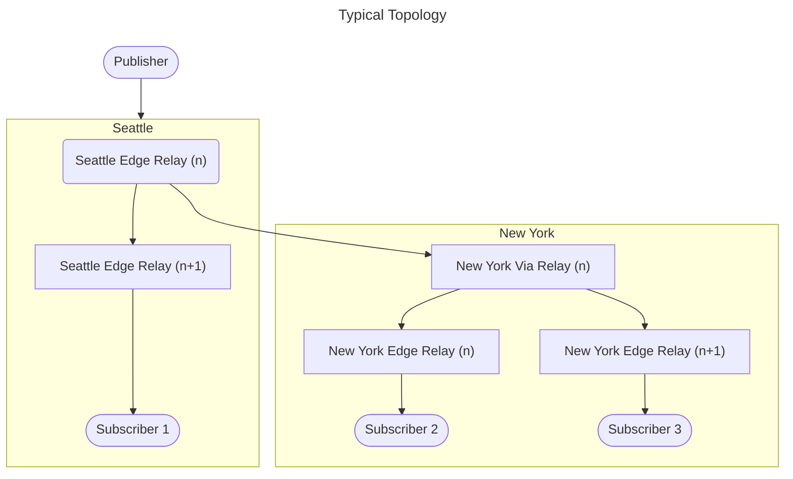

#### Topology Showing Alternate Paths

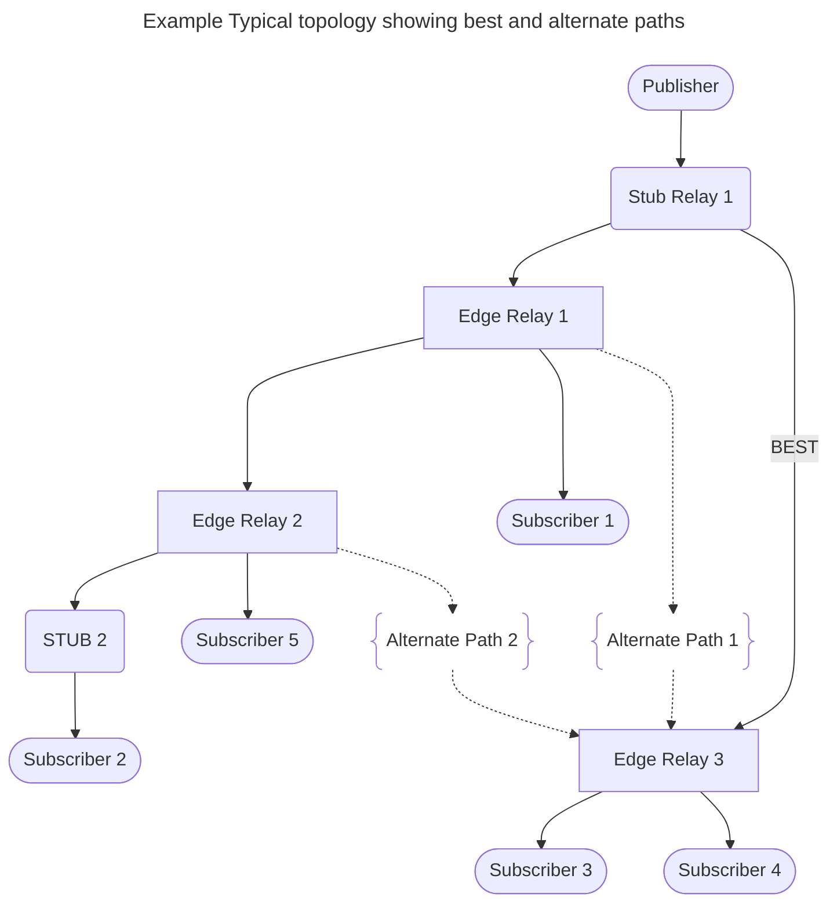

## Peering Modes

Peering connections operate in one of three modes.

### (1) Control Peering

In this mode, only control messages are exchanged. Mostly [Information Base](#information-bases) messages are exchanged
in this mode. This mode allows a single connection for control plane functions without requiring the control signaling
to follow data forwarding paths. Control signaling does not often need more than a single connection
(can include redundant connection for HA) while [data peering](#2-data-peering) messages can benefit
from having more than one QUIC connection to scale data forwarding over network ECMP paths. 

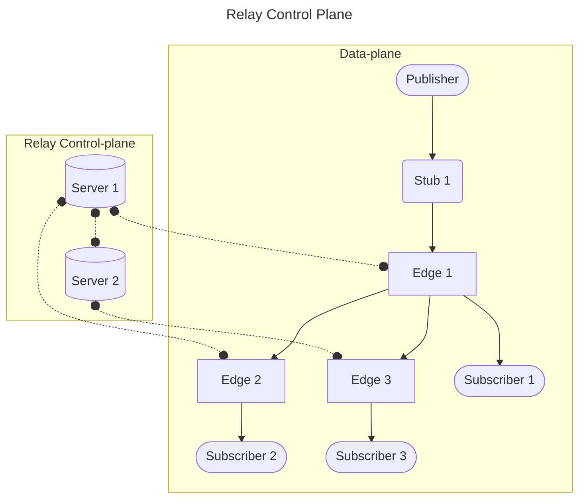

#### Sending/Receiving Control Messages

Control messages are exchanged over a QUIC bi-directional stream. The peer that makes the connection is required
to create the bi-directional stream that will be used for control messaging. All control messages will
go over this QUIC stream. [Connect](#connect-message) is required to be the first message exchanged on a new
connection. To exchange this message, the client **MUST** create the control bi-directional QUIC stream. The
server side will latch onto this stream to send back responses and subsequent control messages to the client. 
The latching allows the client to recreate the control bi-directional stream if needed. The server will
latch and move to the new stream based on received control messages from the client. At no point can
two bi-directional controls streams be in use. To ensure this, the server will reset the previous control
bidir stream if it wasn't already reset/fin closed. 

### (2) Data Peering

Data peering is used to forward data objects in a [pipeline fashion](#pipelining). Data peering can operate in
**uni-directional** or **bi-directional** modes.

In bi-directional mode, data peering will reuse the connection to send data back to the peer. This is to
support NAT and/or firewall constraints.

In uni-directional mode, the peer is used only for receiving data.

Data peering mode is indicated in the `connect` and `connect_response` messages.

> [!IMPORTANT]
> In data peering mode only, the Control bidirectional stream is used to convey [SNS](#data-forwarding)
> advertisements. In this sense, the control stream is always established, even when control peering is
> not used for the data peer. 

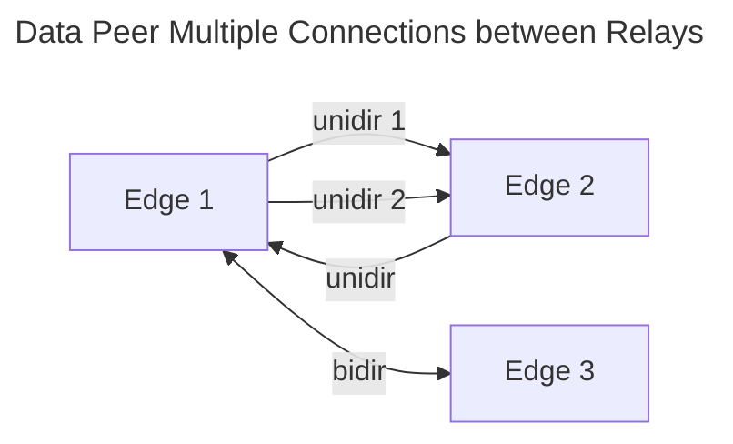

[Stub](#peering-modes) peers always operate in bi-directional mode because it is assumed that they are behind NAT/FW.
Stub relays also do not have the scale that requires multiple connections to support network ECMP. 

### (3) Both control and data peering

When multiple parallel connections are used, only a single peer **MUST** be used in this mode. The peer can opperate
in uni-directional or bi-directional modes. 

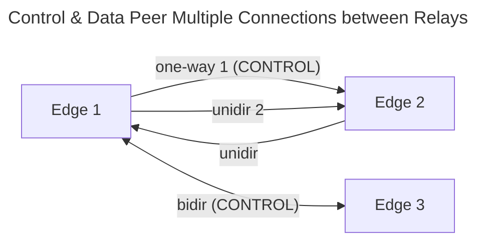

Control peering is always bi-directional and uses the same peering session. 

## Information Bases

Information bases (IB) hold the control plane information. Information is advertised and withdrawn to maintain the
information bases.

### Node Information

Node information base (NIB) conveys information about a node itself. It is exchanged in [connect](#connect-message) 
and [connect_response](#connect-response-message) messages to indicate the peer info of the nodes
connecting. If the peer is a control peer, node information of other nodes are sent to the peer. 
Upon transmission of the node information, the path is appended with self node ID. This forms a node path so
that forwarding can stop when it sees remote or itself in the path list. Only best nodes selected are advertised. 
Nodes information is not sent if it's the same as received before, duplicate. It will be advertised if there is
a change. This is to support metric changes, such as load and reachability information changing in node information.

Currently a version of the node update is not required, but may be added in the future if race conditions arise. 

Removal of `node_info` is performed when the direct peering session is terminated or upon receiving a withdraw of
the node information.  The node withdraw will be sent to all peers except the one that sent it and if the peer
is in the path. 

The best path selection will take place to find another path for active subscribes that are using the 
node that is withdrawn. 

The NIB contains the following:

| Field/Attributes          | Description                                                                          |
| ------------------------- | ------------------------------------------------------------------------------------ |
| [NodeId](#node-id)        | Node ID of the node as a unsigned 64bit integer                                      |
| [Node Type](#relay-types) | Node Relay Type                                                                      |
| **Contact**               | FQDN or IP to reach the node. This maybe an FQDN of the load balancer or anycast IP  |
| **Longitude**             | Longitude of the node location as a double 64bit value                               |
| **latitude**              | Latitude of the node location as a double 64bit value                                |
| [Node Path](#node-path)   | Path of nodes the node information has traversed                                     |
| SumSrtt                   | Sum of SRTT in microseconds for peering sessions in the path, zero if peer is direct |

> [!NOTE]
> Other fields will be added in the future to further describe the node to support administrative policies
> and better path selections.

#### Node ID

Node ID is the unique ID of the node. Nodes **MUST** be configured with different Node IDs. If more than one Node
uses the same ID, only the first (oldest) will work. The others will be dropped.

The Node ID is an unsigned 64bit integer that is configured using the below
textual scheme. The textual scheme aids in simplified assignment, automation,
administrative configuration and troubleshooting.

**Scheme**: `<high value>:<low value>` textual format. The colon is **REQUIRED**.

The values can be represented as an unsigned 32bit integer or dotted notation of 16bit integers,
such as `<uint16>.<uint16>`. The values can be mixed in how they are represented.

**Examples**: All the below are valid configurations of the Node ID

- `1.2:1234`
- `1:1`
- `100.2:9001.2001`
- `123456:789.100`

> Simple deployments may automate the Node ID value using a 64bit hash of the node device or host ID or FQDN (if unique).

#### Node Path

Node Path is an array of node path items (NPI). NPIs are appended to the path upon advertisement via the peering
session. Self node information always is sent with an empty path. For example, the path has a length
of zero when advertising self to a peer session.

NPIs contain the following fields.

| Field               | Description                                                                                      |
| ------------------- | ------------------------------------------------------------------------------------------------ |
| [Node ID](#node-id) | Node ID of the node sending the advertisement                                                    |
| **sRTT**            | Smooth round trip time in microseconds of the peering session the node info was **received via** |

> [!NOTE]
> Other fields will be added in the future based on changes to [selection algorithm](#selection-algorithm)

The Node Path is used to prevent loops and to compute the best path to the Node ID being advertised. Computing the
best path also includes other node info, such as geo-distance, constraints, etc.

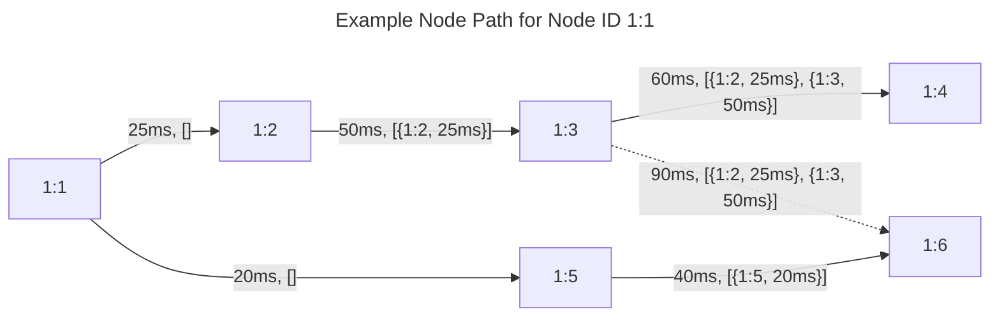

Using [selection algorithm](#selection-algorithm), below shows each node and what it has computed as best path for
Node `1:1`

- Node `1:2` - Path length is `0` (direct) and sum(sRTT) is `25ms`
- Node `1:3` - Best is path length `1` and sum(sRTT) of `75ms`; alternate is path length `2` sum(sRTT) of `150ms`
- Node `1:4` - Path length is `2` and sum(sRTT) is `135ms`
- Node `1:5` - Path length is `0` (direct) and sum(sRTT) is `20ms`
- Node `1:6` - Path length is `1` and sum(sRTT) is `60ms`

If a new connection were established between `1:4` and `1:6` with a sRTT of less than `75ms`, `1:4` would
select the path via `1:6` with a path length of `2` and sum(sRTT) of less than `135ms`

### Announcement Information

MoQT announce of namespace tuple and name are advertised in `announce_info` messages. Only the hash of each namespace
item and name are advertised. `announce_info` is advertised to all peers **from Stub relays only**. Announce information
is not used by the other relays because they have all subscribe information. Stubs do not have all subscribes, so
the o-relay needs the announce info so that it can send only the subscribes matching the announces to the stub.

Loop prevention is performed by not forwarding `announce_info` messages that have already been seen. 

Withdraw of `announce_info` is sent to all peers to remove an entry upon MoQT unannounce.

Announce Information (`announce_info`) contains the following:

| Field          | Description                                                                                             |
| -------------- | ------------------------------------------------------------------------------------------------------- |
| FullNameHashes | Array of the **namespace tuple** hashes and optionally hash of **name**. Only 64bit hashes are encoded. |
| source_node_id | The node ID that received the MoQT announce                                                             |

### Subscribe Information

MoQT subscribe namespace tuple and name are advertised in `subscribe_info` messages. The hashes of namespace tuple
and name are the primary information being used by the relays for peering.  The hashes combined establish a unique subscribe. 

Subscribe information in MoQT includes more information, such as parameters, priority, etc. These
values, including the original opaque data of the subscribe namespace and name, are needed by o-relays to
interact with the MoQT publisher. In order to ensure that nothing is left out, the original subscribe data (entire subscribe) message is encoded in the `subscribe_info`. This allows any relay or control server to inspect and process
the original subscribe message. The original subscribe data is not used by other non o-relays and is instead
transparently passed along. 

`subscribe_info` is advertised to all control peering peers. As described in
[Control Peering](#1-control-peering), this may be forwarded in a highly scalable decentralized control-plane
for peering information bases.  The control-plane is not the data forwarding-plane.  It's only for control and
information base messages, which will mostly be subscribe information.  

Subscribe information is designed to be scoped by administrative policy controls. This is similar to BGP
route policies. The lack of subscribe info is a form of control and filtering that directly impacts data forwarding
to subscribers.  For example, subscribes outside of the allowed region for a publisher will never be seen
by the publisher o-relay... resulting in those out of region subscribers not receiving the content. Out of
region subscribers in this case could quickly be notified of being out of region based on the administrative
policy controls. 

Subscribe to publisher is a function of [matching announce](#matching-subscribes-to-announcements) info. 

Loop prevention is performed by not forwarding `subscribe_info` messages that have already been seen and by
not sending the subscribe back to the one that originated it. 

Withdraw of `subscribe_info` is sent by the node that received the MoQT unsubscribe. Withdraws are sent
in the same fashion as advertisements to control peers. 

> [!NOTE]
> There are race conditions introduced with propagation between control peering peers. If there was enough
time between withdraw and advertisement to propagate and sync state before changing from withdraw to advertised,
then there would be no issues. On the other hand, if a withdraw happens very fast (e.g., sub-second) followed by an
advertisement it can result in a withdraw being received after an advertisement that should have been the
actual final state.  To mitigate this issue, a `sequence` number is added to the `subscribe_info` message.
The sequence number increases for every s-relay message sent. Control peering relays in the middle do not
increment the sequence number. This allows any relay to detect the proper order of withdraw to advertisement
so the final state will correctly be established. 

Subscribe information (`subscribe_info`) contains the following:

| Field          | Description                                                                                 |
| -------------- | ------------------------------------------------------------------------------------------- |
| sequence       | Sequence number to indicate the subscribe advertisement/withdraw message, set by s-relay    |
| source_node_id | The node ID that received the MoQT subscribe                                                |
| TrackHash      | Array of the **namespace tuple** hashes and hash of **name**. Only 64bit hashes are encoded |
| subscribe_data | Original MoQT subscribe message (wire format) that initiated the subscribe                  |

## MoQT Track and Relay Peer Handling

Track as defined by MoQT is a data flow that is identified by track alias, which is a unique value that 
represents the full track name (namespace tuple and name) in subscribes. Fan-out is made possible by relaying
the data from a given track alias to all subscribes (e.g., s-relay, subscribers) that match the same
track alias. 

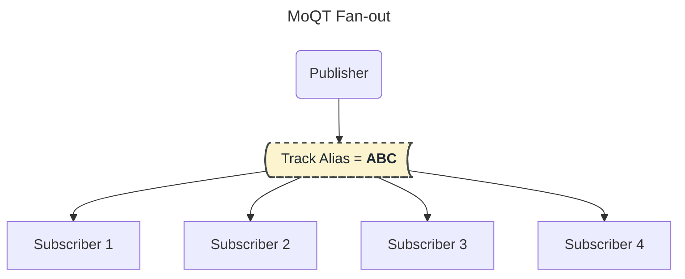

In the above high level diagram, it illustrates that publisher publishes to a track alias. That track alias matches
a set of subscribers using the same alias. Publisher **MUST** publish to the exact subscribe track alias. 
Data is then fanned-out to all the matching subscribers. 

> [!IMPORTANT]
> In MoQT the track alias can be different between subscribers and publishers.  The peering architecture normalizes track alias to be a consistent hash of the opaque namespace tuple and name.  Subscribers and publishers can still use their own track alias, but those will be mapped to the consistent hash upon forwarding via peering. For efficiency, it's recommended to use the `SUBSCRIBE_ERROR(retry track alias)` method to have both publisher and subscribers use the same consistent hash algorithm for track alias.

In peering, the track is referred to as a **data context** using QUIC layer transmission. In MoQT,
the data context uniquely identifies a flow of same content data (e.g., track, file, ...) that can
span over many streams. As with MoQT, there can only be one active QUIC stream at a time for the same
data context (e.g., track). Transitioning to a new QUIC stream primarily is to mitigate some problem with
the stream of data, such as head of line blocking. It can also be used by an application to restart
a content stream at a new point. For this reason, a new stream results in a replacement operation of the
previously active QUIC stream. Data relating to the previous QUIC stream is cleared and upon new stream data flows
afresh. This is required for [pipeline forwarding](#pipeline-forwarding) so that data does not become corrupted. 

A **data context** has an `Id` that is provided by the transport, that is connection (peer and MoQT client) session
specific.  [Subscriber Node Set Id](#source-routing) is created for each data context, which is for each
MoQT track.  An implementation may use the same `Id` for both SNS and data context ID.  

> [!NOTE]
> The reason why data context Id is not directly using track alias value is because connections
> are ephemeral to support encoding in 4 bytes maximum instead of up to 8 (wrapping supported) at the
> session level while providing a guarantee of ZERO collisions. Data context is agnostic to
> the data that is being sent. More than one data context Id could map to the same track alias. This is 
> to support multiple publishers, where publishers are publihsing to the same track alias. Data is
> [pipline forwarded](#pipeline-forwarding) and requires a single publisher for the pipe (aka data context).

In MoQT, data objects contain a **group-id**, **subgroup-id**, and **object-id**.  When the 
**group-id** or **subgroup-id** changes, the MoQT behavior is to transition to a new QUIC stream. MoQT
in this case adds more state and comparison tracking that isn't needed needed for relay forwarding,
especially with peering. The publisher will be the one that detects group/subgroup id changes and will
start a new QUIC stream. The receiving relay will efficiently see that a new stream is being
used for a data context (e.g., track). Upon this, the relay will relay that change to all
peers and clients. In this sense, the relay and peering follow the received QUIC stream transitions. 

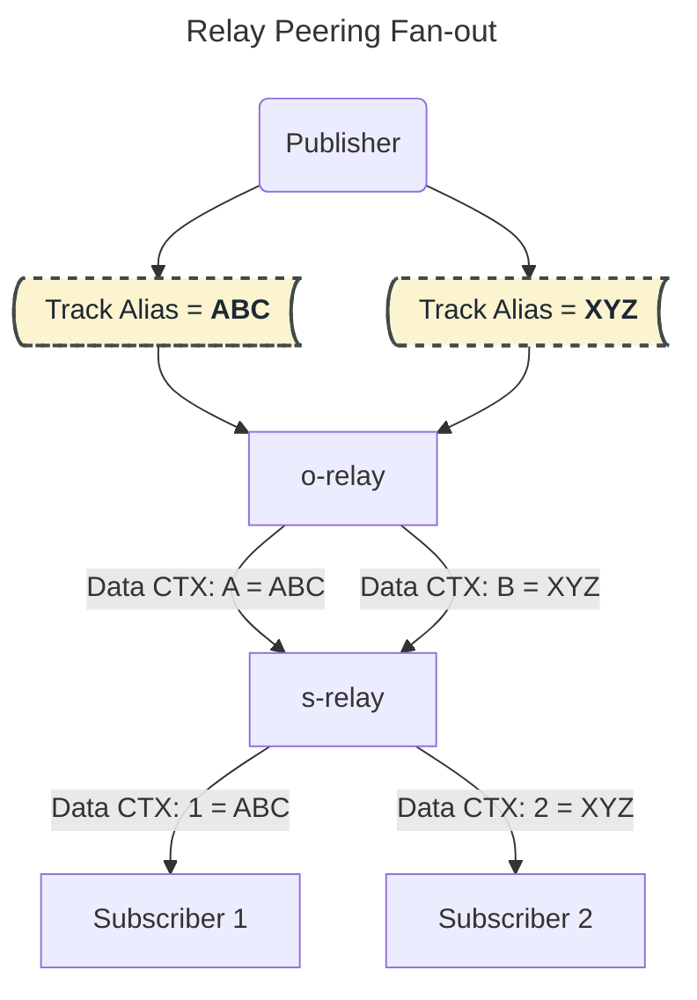

> [!IMPORTANT]
> In the above diagram there is a single publisher, but there could be more than one publisher that is
publishing to the same track alias. While MoQT doesn't yet handle multiple publishers to the same
subscription, this protocol does by using data contexts in this fashion.  This protocol therefore
supports [pipeline forwarding](#pipeline-forwarding) with **one or more publishers to the same track**.

## Connection Establishment

Peers can be established by either side. Only one peer connection can be used for control peering. If multiple
parallel connections are established, the first connection made will be used for control peering bidirectionally.

Data peering can be used over all connections. The mode of the peering session indicates control verses
data or both. If mode is data peer, the data mode can be unidirectional or bidirectional. If bidirectional,
return data will be sent via the established peering connection. Bidirectional peering is to support 
NAT and firewall use-cases. 

> [!NOTE]
> Data streams are always unidirectional, where the sender sends unidirectional to the remote side of the
> connection. Connections are bidirectional and support unidirectional streams and the control
> bidirectional stream.

A race condition exists if peer connections are initiated by both relays at the same time. In data forwarding, both
connections can be used. For control, the peer that is established first wins and if they both are established at
the same time, the peer that has the **lowest Node ID** wins. The result is that only one peering connection between
two Nodes will be used for control information base messages.

The control peering connection **MUST** remain established. Upon termination, all states associated to/from that peer
session will be removed. For example, all nodes learned/used via this session and all announces/subscribes via
the session will be removed.

## Selection Algorithm

The selection algorithm will evolve over time to include more granular metrics on load, usage, best via relays for
aggregation, and administrative/business policy constraints,...

AI and ML will be used in the very near future to optimize v-relay nodes to inject. The selection
algorithm will be updated to establish the selection of nodes at start and ongoing. For example, 
it is expected and fully supported to inject or change v-relays at any time to mitigate network issues,
load issues, or to aggregate bandwidth based on changing of subscribers and other factors. The
forwarding-plane change is ZERO loss. 

In the near future; Reachability is checked and maintained by nodes to know if it can reach v-relays and other e-relays. 
It is also likely that a pre-selection of v-relays by the s-relay will be added to Node information. Node advertisements convey this information via control peering. All nodes know which nodes can reach the s-relay and other relays.
The selection algorithm will use this information to select which node to forward via, which is performed hop-by-hop.

At this time, peering is setup ahead of time by configuration and uses the selection algorithm to find
the shortest and best path. 

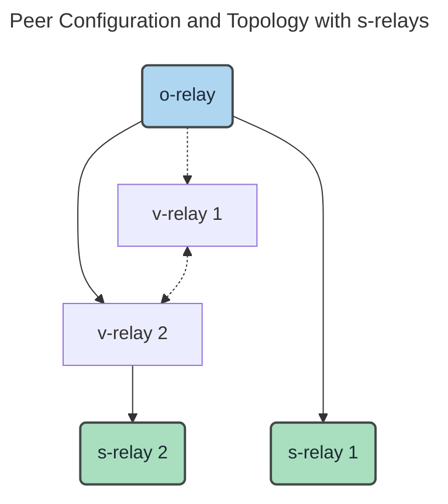

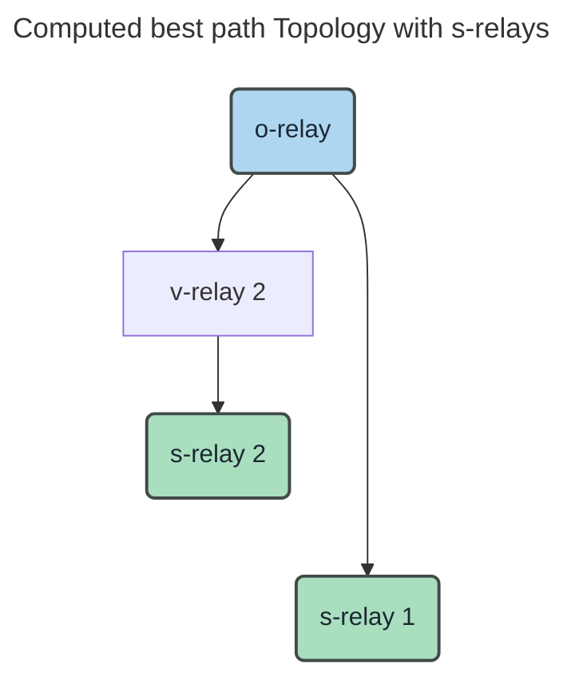

The above is a simple illustration of a computed topology using the initial selection algorithm defined below.
In this example, v-relay-1 is not used because there is a better path to s-relay 1 directly via v-relay 2. 
If peering were to be removed between o-relay and v-relay-2, the selection would use v-relay 1.  

Below is the current implemented selection algorithm:

1. Prefer the shortest path len (number of transit hops)
2. Prefer the lowest sum of sRTT for all paths and the sRTT of the peering session itself

## Data Forwarding

Data is forwarded using a data header that is included in every datagram message and start of every QUIC stream.
QUIC streams enable pipeline support where data is forwarded bytes-in to \[fan-out\] bytes-out. Pipeline forwarding
reduces the end-to-end latency and jitter on data between publisher edge relay to all subscriber edge/stub relays.

### Source Routing

Data forwarding is source routed in a similar fashion as described in [Segment Routing Architecture](https://www.rfc-editor.org/rfc/rfc8402.html).
Data forwarding in MoQT is designed to support fan-out of one or more publishers to one or more subscribers. This
is different from IP forwarding (point to point) in terms of the label stack size. Building a stack of labels
for all target nodes could grow into the thousands with a large number of subscribers spanning thousands
of edge relays. It would not scale to send the set of node IDs in every datagram frame or even start of every QUIC
stream, considering QUIC streams may change often due to group/subgroup changes.

Unlike segment routing where it utilizes a stack of labels/sids, this protocol utilizes
a **subscriber node set (SNS)** that **describes the set of subscriber edge relay (s-relays) node IDs that
need to receive the data**. It does **not describe** the path that the data will traverse. 

The forwarding-plane will be established relay by relay based on node advertisements. Subscribe source node id
is lookup to find the best peer based the [selection](#selection-algorithm). Considering the nodes
and some peering are provisioned before any publishers/subscribers connect, the computation of best
peer is done well before any data is being forwarded. Establishing a forwarding-plane for a publisher to any set of subscribers happens in microseconds internally and upon first data object, hop-by-hop.  

SNS is exchanged via the control bidirectional stream on the peering session that will be used to receive 
the data. Utilizing the control bidir stream within the peer session ensures scope of the SNS to be within
the peer session to support parallel peer sessions and control information based peering that is not using
the same data path. Each SNS will be assigned an SNS ID that is unique to the session.
The sender generates the SNS ID.

The SNS ID is an `unsigned 32bit` integer that is a monotonic series increasing.
The ID starts at ONE and can wrap to ONE as needed. Zero is reserved to indicate no ID. The ID can skip
forward but cannot be less than the previous, unless wrap occurs. 

Withdraws remove SNS IDs from active state. States are peer scoped and will be removed upon peer session close.

The design of subscriber node sets is to be fast and lightweight with little control signaling involvement to maintain
state. Node sets can change often based on node (e.g., relay) churn with peering sessions and subscribers. This
will result in the SNS being updated. Using a new ID to replace the previous introduces race conditions where data
could be lost. Instead of replacing the ID, the **same ID is updated** with a new set to allow a smooth transition
without invalidating a previous set id.

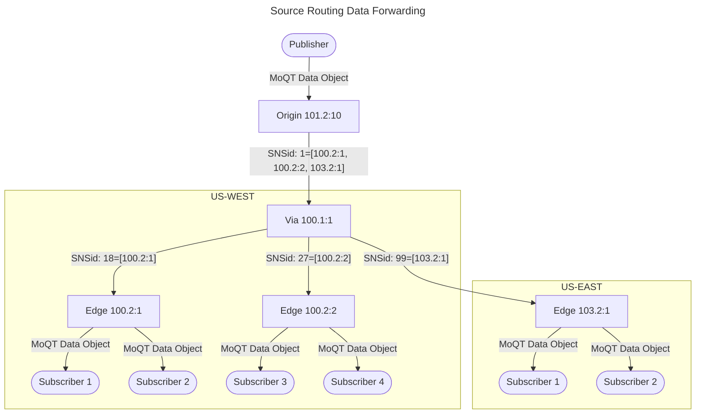

#### SNS Advertisement

A new transport data context is created to handle the track data flow. Considering the transport
connection ID already provides a session specific ID that increments by one, it can be used
as the SNS ID. In order to create a new data context, the session needs to be known. Therefore,
a SNS is created with a computed set of downstream nodes by peering session that should be used,
which is based on [selection](#selection-algorithm). Upon identifying the peer session with
the SNS per peer, a data context is created that provides the ID. The SNS is then advertised
via the control bidir stream in parallel with data being transmitted and encoded with
the [data header](#start-of-data-header).

Considering the receiving side may receive data with an SNS ID that it doesn't know about yet,
the receiving side will buffer the messages based on a negotiated buffer time period. If
the SNS ID is not received by that time, the data would be dropped in a circular buffer fashion.

SNS information message has the following fields:

| Field           | Description                                                               |
| --------------- | ------------------------------------------------------------------------- |
| SNS ID          | SNS ID of this entry                                                      |
| Target Node Set | Target node ID set. Array of all nodes that should be forwarded this data |

The target node set is generated based on the [Best Node Information](#node-information) via the peering session.
For example, when subscribes are received by the publisher relay (o-relay) the subscriber information
will indicate source nodes of where that subscribe originated. This node id will be added to a set that
is relative to the peering session that reaches that node based on the [selection algorithm](#selection-algorithm)
This will result in different sets based on selection of which peering session reaches best s-relay nodes that need
to receive the data. In large scale, multiple data peering sessions will be utilized, so the sets will be
a subset of total number of s-relay nodes. STUBS are not included. Only Edge relays are added to
this set.

##### FIB

Nodes are computed ahead of time when node advertisements are received. A map is updated to maintain 
which peers are best to reach the advertised s-relay node. Recall that all nodes are advertised, 
which includes all s-relay nodes. The FIB is maintained real-time upon subscribe advertisement to find the best
peer session (future will establish on-demand peering, including v-relays).

> [!NOTE]
> Subscribes are only conveyed for an s-relay. A s-relay may have many subscribers, but only one peering
> control subscribe is advertised.  This compresses the churn of subscribes of clients by s-relay.

The best peer session is likely to have many s-relays associated to it. On the first subscribe, 
the peer session would have an SNS created with the first s-relay added to it. This will create a data context
as described previously. Upon additional subscribes, the s-relays that are new will be added to the SNS.
Since the same SNS Id is used, no stream changes are needed. Data will continue to flow without interruption
as s-relays are added and removed. 

Via Relays (v-relay) do not participate in announces or subscribes with the exception of being a passthrough for
control peering. For data forwarding, v-relays lookup the best path to reach s-relays using the SNS advertisement.
The best peer session will be found for each s-relay in the advertisement. It's likely the same peer will be used
for many s-relays. Upon finding the best peer, the first s-relay added to the peer session will result
in an out going SNS Id being created with one or more of the SNS advertisement s-relays being added to it. A map is
used to track ingress SNS Id to Egress SNS Id(s) via peer sessions. Only the first creation results in the creation
and update. Data is then forwarded efficiently using the FIB map based on In to Out SNS Ids. 

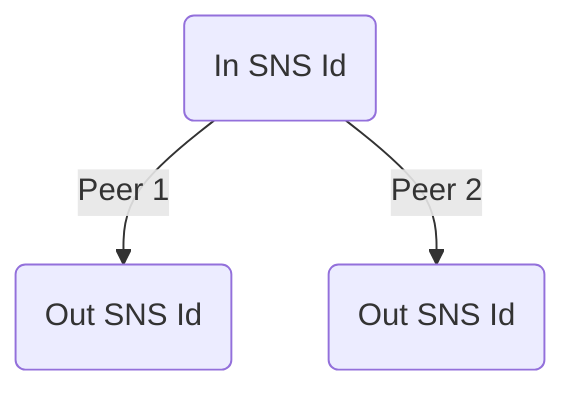

#### SNS Withdrawal

The sender removes the SNS Id by issuing a withdraw. It does this when there are no subscribers left. If the
peering session disconnects, the SNS Ids are removed.

Withdraw SNS information message has the following fields:

| Field  | Description                   |
| ------ | ----------------------------- |
| SNS ID | SNS ID of the entry to remove |

### Pipeline forwarding

Datagram objects are inherently pipelined and no special handling is needed. 

Data forwarded by relays are pipeline forwarded at the stream level. Every byte received is immediately 
sent out to other peers and clients. MoQT publishers encode all needed headers for the subscribing clients
to reassemble. This includes the cache implementation within the relay that acts as a client receiving the data.
Relay nodes do not need to mutate any received data. MoQT data object headers are unchanged from received to
all peers and MoQT sessions. The relay in this sense is forwarding every byte received on a stream to peer
and client sessions on a stream. 

MoQT Track QUIC stream transitions (e.g, group/subgroup change) received are mirrored to all peer and client sessions. 

Reassembly of data objects is only performed by subscribing clients and relays that implement caching. A relay that
implements caching is acting like a MoQT client that subscribes and publishes. 

In order to support pipeline forwarding there is a need to convey some extra information about how to forward and
start a new stream for egress peers and client sessions.  The [start of stream header](#start-of-stream-data-header) defines
the fields that are added for peering. SNS Id is used to lookup outgoing peer sessions and SNS Ids for each. When
the the SNS Id contains the node itself, then the node lookups up MoQT client sessions that should receive
the data. Looking up MoQT client sessions do not use SNS Id, so the track alias is used instead. 

Client MoQT sessions do not need this header and are sent data minus this header.  

The reason why this extra information is encoded in data start of QUIC stream header instead of SNS advertisement
is to allow SNS to be reused for different track aliases and priorities later.  We will revisit
if some of the start of stream data header info should be moved to SNS advertisement. 

### Matching Subscribes to Announcements

Subscribes are delivered via the control information base forwarding. The publisher edge relay (o-relay) receives
the subscribe via the control peering. Upon subscribe, all announces are checked to see if there is a match.
Matching the announce to subscribe is performed by matching the namespace tuple of hashes and name in the order defined.
Each tuple is matched using an exact match. The order must match. If the announce has less tuples, but matches
all the subscribe tuples up to the announce set, a match is considered found and the publisher will receive
the subscribe. This will trigger SNS and forwarding plane to be built. This is performed based on the subscribe
and publisher accepting that subscribe by sending a subscribe OK back to the s-relay. 

## Messages Formats
This section defines all the peering messages and their encoded wire format. 

### Connect Message

### Connect Response Message

### Data Object Message

#### Start of Stream Data Header

QUIC unidirectional data streams start with the following header fields:

| Field                | Description                                                                                                                          |
| -------------------- | ------------------------------------------------------------------------------------------------------------------------------------ |
| HDR Length           | Header length in bytes, up to the payload bytes                                                                                      |
| Type                 | Type of data being datagram (0), exiting stream (1), or start of new stream (2). Type is used internally and **not transmitted**     |
| SNS ID               | unsigned 32bit unique subscriber node set ID within the session scope that identifies which target nodes the data should be sent to. |
| Track full name hash | Track full name hash (aka MoQT track alias)                                                                                          |
| Priority             | The priority that should be used by the relay when sending to other peers/clients                                                    |
| ttl                  | Time in milliseconds that this object should last in queue before being dropped                                                      |

### Node Information Advertisement Message

### Node Information Withdraw Message

### Subscribe Information Advertisement Message

### Subscribe Information Withdraw Message

### Announce Information Advertisement Message

### Announce Information Withdraw Message

### Subscribe Node Set Advertisement Message

### Subscribe Node Set Withdraw Message

## Considerations

### Optimizing Peering using MoQT GOAWAY

In large scale deployments, the usage of [source routing data forwarding](#source-routing) can result in large sets
of target edge nodes that have subscribers to receive data. This can be suboptimal if every subscriber was on
a different edge relay, especially when in the same region. This could happen due to network load balances,
including anycast, where subscriber clients are distributed to one of hundreds of relays within the same region.
It is desirable to align subscribers of the same content to use the same relays, providing load/capacity is available.
MoQT provides a mechanism to redirect a client connection to another relay. This method is to use a GOWAY with
a new connect URL. This protocol uses the GOAWAY (aka redirect) to redirect client connections to a nearby relay that
has the same subscriptions.

Edge relays are stateless, but they do have the control information bases to look this up received
subscription information from other relays and node information to intelligently balance/move clients to
other relays that have the same subscribes.

### Unsubscribe/Subscribe Misuse

The last MoQT subscriber unsubscribe can result in many relays having to change states. If the subscriber is
repeatedly unsubscribing and subscribing, it will result in a ripple effect over many relays, which
causes unnessary churn in the relay network. To mitigate this churn, unsubscribes in peering could be
scheduled in the future based on some configurable time, such as 5 seconds. If a MoQT subscriber
subscribes again before the scheduled unsubscribe being sent, it would simply be canceled and
data would continue as if there was no unsubscribe. Only the MoQT client would be the one that
would stop and start repeatedly. The churn of misuse with unsubscribe and subscribe would
be contained to the s-relay instead of spreading the churn to many other relays.

## Message Flows

Various message flows

### Connection Establishment

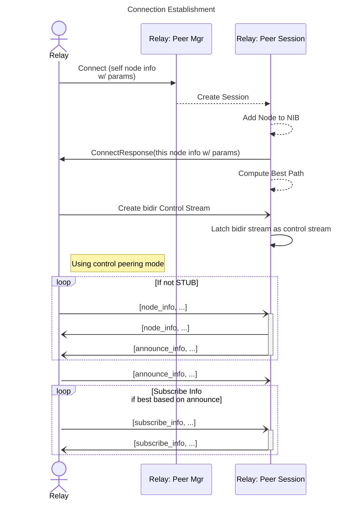

### Node Advertisement

### Node Withdraw

### Publish Announcement

Announces are flooded to all control peers, except to STUB peers. STUB peers do not require announces as they use
static routing. By default, STUB peers will advertise all subscribes.

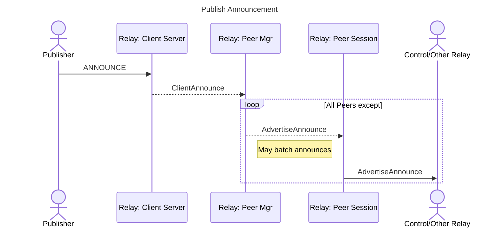

### Subscribe Advertisement

Subscribes are only sent to best peer sessions based on announce source node.

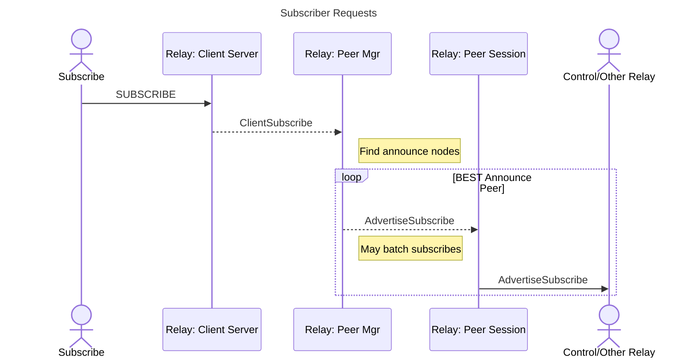

### Publish Announce Withdraw

### Subscribe Withdraw

### Subscriber Node Set Advertisement

### Subscriber Node Set Withdraw

### Data Object Fan-out

### Subscribe Add

### TODO Implementaton

Items to be implemented still

* Stub relay type with configuration option
* Via relay type with configuration option
* Distributed control peering servers
* Add dynamic peering
* Add reachability probing and detection of location
* Update selection algorithm to include dynamic peering as well as load and reachability
* Add administrative policy support

