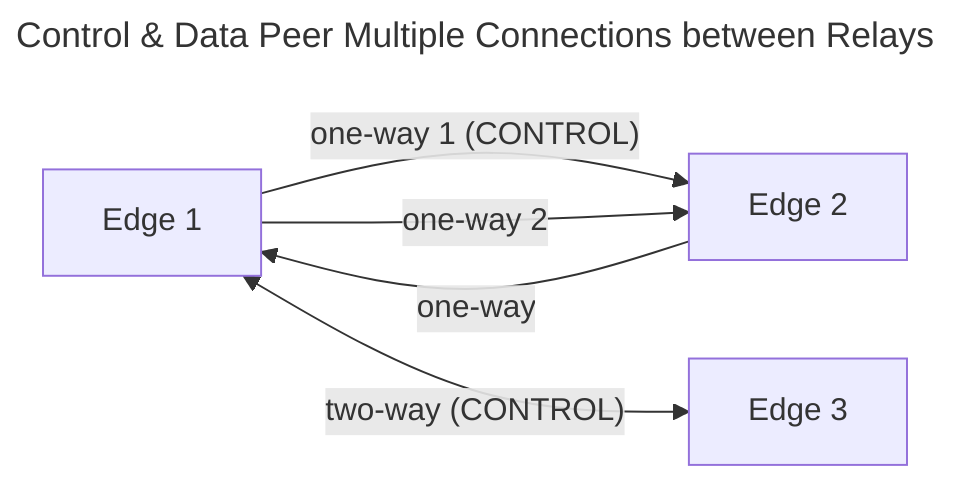
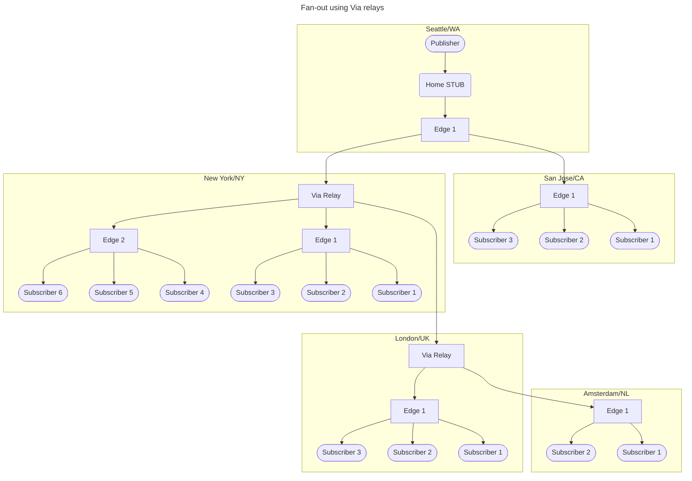
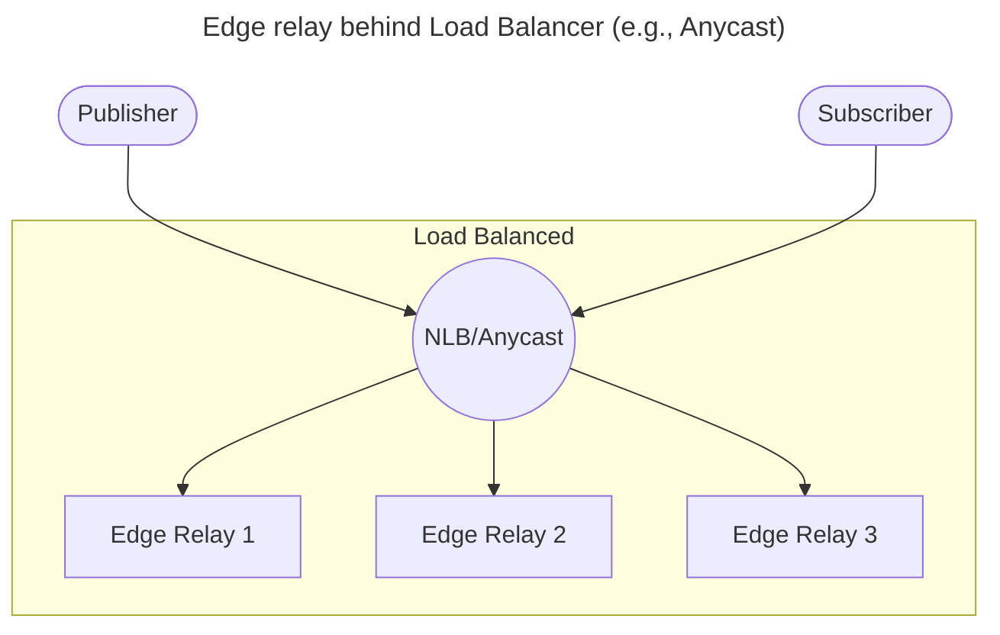
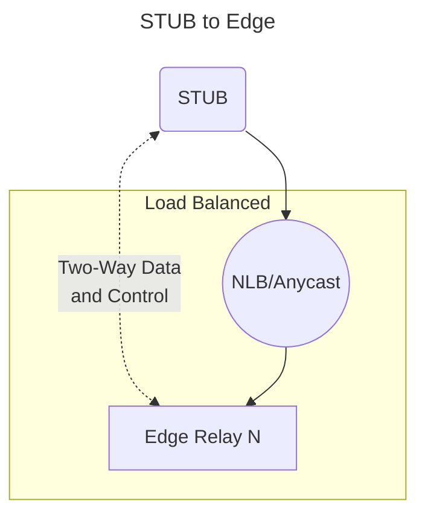
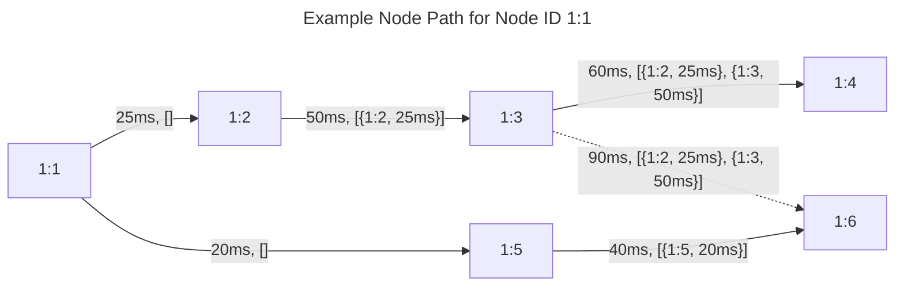
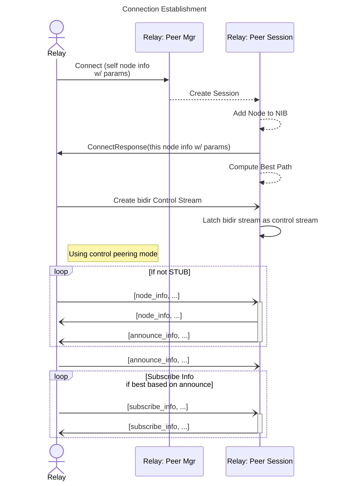
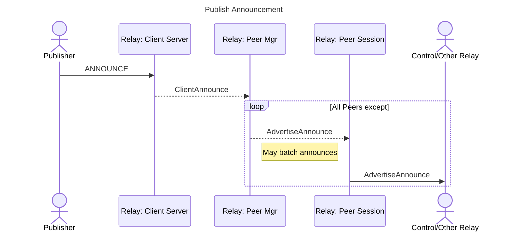
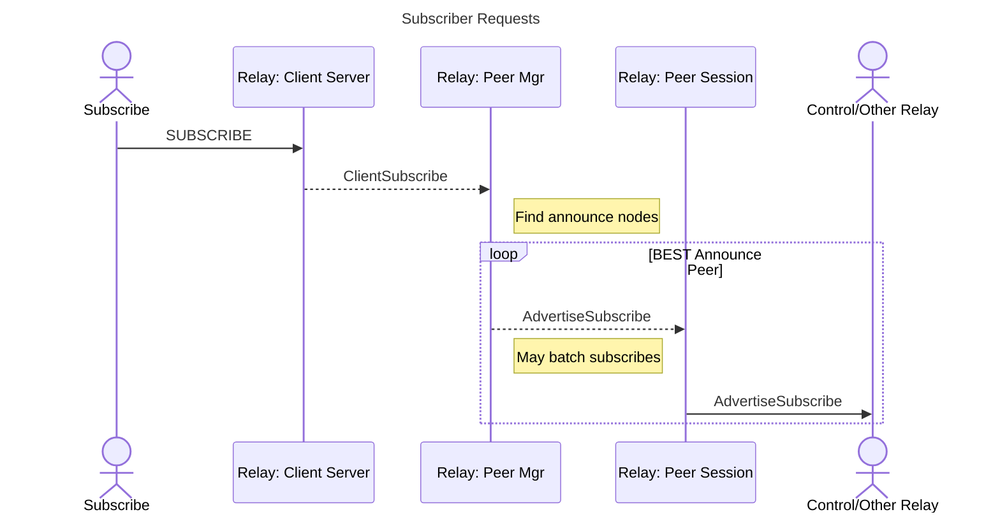

# LAPS Peering Protocol and Architecture

LAPS peering architecture enables peering between relays supporting granular traffic engineering and optimizations. 
Peering can be simple mesh style or it can be more complex with on-demand peering sessions with the ability to
control and enforce various constraints. Peering includes a node topology that enables the ability to select
based on constraints, load, bandwidth, and other important traffic steering metrics.

Peering scales to a global network of relays supporting scale into hundreds of millions of active
tracks with any combination of publishers and subscribers.

The high level topology looks like the following:
```mermaid
---
title: High Level Topology
---
flowchart TD
    P([Publisher]) --> STUB1(Stub Relay 1)
    STUB1 --> E1[Edge Relay 1]
    STUB1 -- Best --> E3[Edge Relay 3]
    E1 --> E2[Edge Relay 2]
    E1 ----> S1([Subscriber 1])
    E2 --> STUB2(STUB 2)
    STUB2 --> S2([Subscriber 2])
    E2 --> S5([Subscriber 5])
    E1 -. alt .-> E3
    E3 --> S3([Subscriber 3])
    E3 --> S4([Subscriber 4])
    E2 <-. alt .-> E3
 ```


## Peering Modes

Peering connections operate in one of three modes.

### (1) Control Peering

In this mode, only control messages are exchanged. Mostly [Information Base](#information-bases) messages are exchanged
in this mode. This mode allows a single connection for control plane functions without requiring the control signaling
to follow data forwarding paths. Control signaling does not often need more than a single (can include redundant
connection for HA) while [data peering](#2-data-peering) messages can benefit from having more than one QUIC connection to scale
data forwarding.

```mermaid
---
title: Relay Control Plane
---
flowchart TD
    subgraph Relay Control-plane
        CTRL1[(Server 1)] o-.-o CTRL2[(Server 2)]
    end
    
    CTRL1 o-.-o E1[Edge 1]
    CTRL1 o-.-o E2[Edge 2]
    CTRL2 o-.-o E3[Edge 3]
    
    subgraph Data-plane 
    P([Publisher]) --> STUB1(Stub 1)
    STUB1 --> E1[Edge 1]
    E1 --> E2[Edge 2]
    E1 --> E3[Edge 3]
    E1 --> S1([Subscriber 1])
    E2 --> S2([Subscriber 2])
    E3 --> S3([Subscriber 3])
    end
 ```

### (2) Data Peering

Data peering is used to forward data objects in a [pipeline fashion](#pipelining). Data peering can operate in
**one-way** or **two-way** modes. 

In two-way mode, data peering will reuse the connection to send data back to the peer. This is to
support NAT and/or firewall constraints. 

In one-way mode, the peer is used only for receiving data. 

Data peering mode is indicated in the `connect` and `connect_responsse` messages. 

```mermaid
---
title: Data Peer Multiple Connections between Relays
---
flowchart LR
    E1[Edge 1] -- "one-way 1" --> E2[Edge 2]
    E1 -- "one-way 2" --> E2
    E2 -- "one-way" --> E1
    E1 <-- "two-way" --> E3[Edge 3]
```

[Stub](#peering-modes) peers always operate in two-way mode because it is assumed that they are behind NAT. 

### (3) Both control and data peering

When multiple parallel connections are used, only a single peer **MUST** be used in this mode. The peer can opperate
in one-way or two-way modes. 



Control peering is always bidirectional and uses the same peering session between two nodes. 


## Relay types

The type of relay is configured when the relay is started, normally via commandline argument or configuration file.
A relay cannot change type during runtime. It must  reconnect to all peers if the relay type is changed.
The relay advertises its type in the self-node information upon `connect`/`connect_response`. 

Relays are classified into the following three categories.

### (1) Via

A Via relay is used by Edge relays to forward data between other Edge relays. A Via relay is an intermediate relay that
does not participate in various [Information Base](#information-bases) exchanges. It still participates in node information base
exchange. 

**A Via relay:**

* Does not need to be part of the `announce` and `subscribe` advertisements and withdrawals selection
  for data-plane forwarding
* It participates in the `node` advertisements and withdrawals to maintain reachability information to all nodes.
* `announce` and `subscribe` advertisements/withdrawals are state maintained, but only to prevent looping and 
  duplication. The retention for this state is set to the maximum convergence time. In this sense, it is a cache
  of seen announces and subscribes in the last several seconds.
* Forwards data streams and datagram objects based on [source routing](#source-routing) using the node information base.
* Traditionally has high vertical scale to support large number of tracks and bandwidth
* Strategically placed geographically near Edge relays to provide an aggregation point for fan-out of many Edge relays.

Peering can go directly to Via or other Edge relays, depending on the [selection algorithm](#selection-algorithm),
which takes into account load, path RTT, path loss, bandwidth, administrative/business policies, etc.



### (2) Edge

Edge relays are core relays that facilitate connections from clients and all [relay types](#relay-types). The Edge
relay is a "**can do it all relay.**" 

These relays often have a lower vertical scale due to them having to do the following extras over Via relays:

* Client connection implementation of MoQT
* Handle several client connections, each of which have different QUIC transport encryption/decryption with varying
  high volume of stream changes based on group and subgroups as defined in MoQT
* Compute subscriber source routing based subscribes (if publisher is attached to edge)
* Perform authorization validation and enforcement
* Perform edge defense with client connections by implementing rate limiting and other DoS mitigations
* On-demand peering establishment based on [selection algorithm](#selection-algorithm)

Edge relays are expected to scale horizontally in a stateless fashion, supporting scale up and scale down based
on demand in the region. Edge relays can be "right-sized" to fit the need of subscriber and publisher demand.

Edges relays are often placed behind network load balancers, which can support **anycast** for both client
and peering connections.



### (3) Stub

Stub relays only connect to one or more upstream Edge relays. Primary use-case for a Stub relay
is to fan-out subscribers and to take advantage of local termination at the access edge. For example, residential
access routers, branch offices, NAT routers, access points. 

Stub relays have the following uses, feature capabilities and restrictions:

* Must peer directly with Edge relays
* Can peer to more than one edge relay but **MUST** select outside of this protocol (e.g., manual configuration) which
 relay peer session will be used for subscribes.  Using more than one peer session for subscribes will result in
 duplicate data 
* Will only receive announcements from Edge relay clients
* Will receive subscribes based on the advertised announcements
* Uses very little memory and CPU for peering
* Use-case for more than one peer is to optimize reachability to other edges, which is not often required
* Normally only one edge peering session needed
* Fully supports NAT and return traffic over the established peer connection
* Uses peer mode `Both`, control and data via the same peer connection. 
* It does not connect to a cloud provider control server (not needed)
* Will not accept inbound peer connections and will not implement the full peering protocol
* The Edge relay that the Stub connects to will forward announces and subscribes by marking itself as the source
  node. Stubs are transparent and stateless. Only the Edge relay is aware of the Stub.  Other Edge and Via relays
  are unaware of Stub relays.





## Information Bases

Information bases (IB) hold the control plane information. Information is advertised and withdrawn to maintain the
information basees.  

### Node Information

Node information base (NIB) conveys information about a node itself. It is exchanged in `connect` and `connect_resposne` messages
to indicate the peer info of the nodes connecting. If the peer is a control peer, node information of other nodes are sent to the
peer. Upon transmission of the node information, the path is appended with self information. Node information is not
flooded to a peer if peer is within the node path. Upon receiving a node, if the node sees itself in the path, it is
dropped. Only best nodes selected are advertised. If it was already advertised to the same peer, it is not advertised
again, unless there is a change in the node information.  

Removal of `node_info` happens when the direct peering session is terminated. Upon receiving a withdrawal of
`node_info`, the `node_info` will be removed for that peer session. The best path selection will take place to
find another path. If a new best path is found and the removal was toward the peer session that withdrew it, the
node will advertise the new best path `node_info` to all other peers. If no best path is found, it will send a withdrawal
to all other peers.

The NIB contains the following:

| Field/Attributes                | Description                                                                         |
|---------------------------------|-------------------------------------------------------------------------------------|
| [NodeId](#node-id)              | Node ID of the node as a unsigned 64bit integer                                     |
| **Contact**                     | FQDN or IP to reach the node. This maybe an FQDN of the load balancer or anycast IP |
| **Longitude**                   | Longitude of the node location as a double 64bit value                              |
| **latitude**                    | Latitude of the node location as a double 64bit value                               |                                     
| [Node Relay Type](#relay-types) | Type of the node relay                                                              |
| [Node Path](#node-path)         | Path of nodes the node information has traversed                                    |

> [!NOTE]
> Other fields will be added in the future to further describe the node to support administrative policies
> and better path selections. 

#### Node ID

Node ID is the unique ID of the node. Nodes **MUST** be configured with different Node IDs. If more than one Node
uses the same ID, only the first (oldest) will work. The others will be dropped. 

The Node ID is an unsigned 64bit integer that is configured using the below
textual scheme.  The textual scheme aids in simplified assignment, automation, 
administrative configuration and troubleshooting. 

**Scheme**: `<high value>:<low value>` textual format. The colon is **REQUIRED**.

The values can be represented as an unsigned 32bit integer or dotted notation of 16bit integers,
such as `<uint16>.<uint16>`.  The values can be mixed in how they are represented. 

**Examples**: All the below are valid configurations of the Node ID
* `1.2:1234`
* `1:1`
* `100.2:9001.2001`
* `123456:789.100`

> Simple deployments may automate the Node ID value using a 64bit hash of the node device or host ID or FQDN (if unique). 

#### Node Path

Node Path is an array of node path items (NPI).  NPIs are appended to the path upon advertisement via the peering
session.  Self node information always is sent with an empty path. For example, the path has a length
of zero when advertising self to a peer session. 

NPIs contain the following fields. 

| Field               | Description                                                                      |
|---------------------|----------------------------------------------------------------------------------|
| [Node ID](#node-id) | Node ID of the node sending the advertisement                                    |
| **sRTT**            | Smooth round trip time of the peering session the node info was **received via** |

> [!NOTE]
> Other fields will be added in the future based on changes to [selection algorithm](#selection-algorithm)

The Node Path is used to prevent loops and to compute the best path to the Node ID being advertised. Computing the
best path also includes other node info, such as geo-distance, constraints, etc.



Using [selection algorithm](#selection-algorithm), below shows each node and what it has computed as best path for
Node `1:1`

* Node `1:2` - Path length is `0` (direct) and sum(sRTT) is `25ms`
* Node `1:3` - Best is path length `1` and sum(sRTT) of `75ms`; alternate is path length `2` sum(sRTT) of `150ms`
* Node `1:4` - Path length is `2` and sum(sRTT) is `135ms`
* Node `1:5` - Path length is `0` (direct) and sum(sRTT) is `20ms`
* Node `1:6` - Path length is `1` and sum(sRTT) is `60ms`

If a new connection were established between `1:4` and `1:6` with a sRTT of less than `75ms`, `1:4` would
select the path via `1:6` with a path length of `2` and sum(sRTT) of less than `135ms`

### Announcement Information

MoQT announce of namespace tuple and name are advertised in `announce_info` messages. Only the hash of each namespace
item and name are sent. `announce_info` is advertised to all peers. Loop prevention is performed by not forwarding 
`announce_info` messages that have already been seen.  

Withdraw of `announce_info` is sent to all peers to remove an entry upon MoQT unannounce.  

Announce Information (`announce_info`) contains the following:

| Field          | Description                                                                                             |
|----------------|---------------------------------------------------------------------------------------------------------|
| FullNameHashes | Array of the **namespace tuple** hashes and optionally hash of **name**. Only 64bit hashes are encoded. |
| source_node_id | The node ID that received the MoQT announce                                                             |


### Subscriber Information

MoQT subscribe namespace tuple and name are advertised in `subscribe_info` messages. Only the hash of each namespace
item and name are sent. `subscribe_info` is advertised to the peering session that is the best path to reach
the source node of [matching announce](#matching-subscribes-to-announcements) info. Loop prevention is performed by not
forwarding `subscribe_info` messages that have already been seen. 

Withdraw of `subscribe_info` is sent by the node that received the MoQT unsubscribe. Changes to the best source
node and peer session may change at any time, resulting subscribes being advertised via some nodes that may
not see the withdrawal when the paths have changed. To mitigate this situation, `subscribe_info` is advertised
to all peers, similar in the same fashion as [announce_info](#announcement-information). 

Subscribe information (`subscribe_info`) contains the following: 

| Field          | Description                                                                                 |
|----------------|---------------------------------------------------------------------------------------------|
| FullNameHashes | Array of the **namespace tuple** hashes and hash of **name**. Only 64bit hashes are encoded |
| source_node_id | The node ID that received the MoQT announce                                                 |

## Connection Establishment

Peers can be established by either side. Only one peer connection can be used for control peering. If multiple
parallel connections are established, the first connection made will be used for control peering bi-directionally. 
Data peering can be used over the other connections.  The mode of the peering session indicates control verses
data or both. If data peer, the data mode can be one-way or two-way.  If two-way, return data will be sent
via the established peering connection. This is to support NAT and firewall use-cases. 

A race condition exists if peer connections are initiated by both relays at the same time. In data forwarding, both
connections can be used. For control, the peer that is established first wins and if they both are established at
the same time, the peer that has the lowest Node ID wins. The result is that only one peering connection between
two Nodes will be used for control information base messages. 

The control peering connection **MUST** remain established. Upon termination, all states associated to that peer
session will be removed. For example, all nodes learned/used via this session and all announces/subscribes via
this session will be removed. 

## Selection Algorithm

The selection algorithm will evolve over time to include more granular metrics on load, usage, best via relays for
aggregation, and administrative/business policy constraints,... 

At this time the below is implemented to select the best peering session to use. 

1. Prefer the shortest path len (number of transit hops) 
2. Prefer the lowest sum of sRTT for all paths and the sRTT of the peering session itself  

## Data Forwarding

Data is forwarded using a data header that is included in every datagram message and start of every QUIC stream. 
QUIC streams enable pipeline support where data is forwarded bytes-in to \[fan-out\] bytes-out.  Pipeline forwarding
reduces the end-to-end latency and jitter on data between publisher edge relay to all subscriber edge/stub relays.  

### Source Routing

Data forwarding is source routed in a similar fashion as described in [Segment Routing Architecture](https://www.rfc-editor.org/rfc/rfc8402.html).
Data forwarding in MoQT is designed to support fan-out of one or more publishers to one or more subscribers. This
is different from IP forwarding (point to point) in terms of the stack size of labels. Building a stack of labels
for all target nodes could grow into the thousands with a large number of subscribers spanning thousands
of edge relays. This would not scale to send the set of node IDs in every datagram frame or even start of every QUIC
stream, considering QUIC streams may change often due to group/subgroup changes. 

Unlike segment routing where it utilizes a stack of labels/sids, this protocol utilizes 
a **subscriber node set (SNS)** that **describes the set of subscriber edge relay node IDs that
need to receive the data**. It does **not describe** the path that the data will traverse.

SNS is exchanged via the peer session that will receive the data using the control stream via that
same peer session. Utilizing the control bidir stream within the peer session ensures scope of the SNS
to be within the peer session to support parallel peer sessions and control information based peering
that is not using the same data path. Each SNS will be assigned an SNS ID that is unique to the session.
The sender generates the SNS ID. 

The SNS ID is an `unsigned 32bit` integer that is a monotonic series increasing by one.
The ID starts at ONE and can wrap to ONE as needed. Zero is reserved to indicate no ID.   

Withdraws remove SNS IDs from active state. States are peer scoped and will be removed upon peer session close. 

The design of subscriber node sets is to be fast and lightweight with little control signaling involvement to maintain
state. Node sets can change often based on node (e.g., relay) churn with peering sessions and subscribers. This
will result in the SNS being updated. Using a new ID to replace the previous introduces race conditions where data
could be lost.  Instead of replacing the ID, the same ID is updated with a new set to allow a smooth transition
without invalidating a previous set id. 


#### SNS Advertisement

A new transport data context is created to handle the track data flow.  Considering the transport
connection ID already provides a session specific ID that increments by one, it can be used
as the SNS ID. In order to create a new data context, the session needs to be known. Therefore,
a SNS is created with a computed set of downstream nodes by peering session that should be used, 
which is based on [selection](#selection-algorithm). Upon identifying the peer session with
the SNS per peer, a data context is created that provides the ID. The SNS is then advertised
via the control bidir stream in parallel with data being transmitted and encoded with 
the [data header](#start-of-data-header). 

Considering the receiving side may receive data with an SNS ID that it doesn't know about yet,
the receiving side will buffer the messages based on a negotiated buffer time period.  If
the SNS ID is not received by that time, the data would be dropped in a circular buffer fashion. 

SNS information message has the following fields:

| Field           | Description                                                               |
|-----------------|---------------------------------------------------------------------------|
| SNS ID          | SNS ID of this entry                                                      |
| Target Node Set | Target node ID set. Array of all nodes that should be forwarded this data |

The target node set is generated based on the [Best Node Information](#node-information) via the peering session.
For example, when subscribes are received by the publisher relay (aka origin relay) the subscriber information
will indicate source nodes of where that subscribe originated. This node id will be added to a set that
is relative to the peering session that reaches that node based on the [selection algorithm](#selection-algorithm)
This will result in different sets based on selection of which peering session reaches best the edge nodes that need
to receive the data. In large scale, multiple data peering sessions will be utilized, so the sets will be
a subset of total number of subscriber edge nodes.  STUBS are not included.  Only Edge relays are added to
this set.

#### SNS Withdrawal
Withdraw SNS information message has the following fields:

| Field  | Description                   |
|--------|-------------------------------|
| SNS ID | SNS ID of the entry to remove |

### Start of Data Header

| Field  | Description                                                                                                                          |
|--------|--------------------------------------------------------------------------------------------------------------------------------------|
| SNS ID | unsigned 32bit unique subscriber node set ID within the session scope that identifies which target nodes the data should be sent to. |

> [!NOTE]
> TODO will add more fields as needed

The SNS ID is changed hop by hop, but it uses a fixed 32 bit value supporting fast offset based changing of the value
with datagram messages. QUIC streams only have this header on start of QUIC stream. Only on new QUIC stream is the
start of data header included.


### Supporting MoQT data Objects in pipeline forwarding

A complication with pipeline forwarding is that the start and end of an object are not known by the intermediate
nodes when relaying the data via QUIC streams. Datagram is moot as each datagram frame is the complete object.
Only the receiving edge relay needs to know the start/end of MoQT QUIC streamed data objects so the data be cached and
sent correctly to the subscriber(s).  To support this with QUIC streams, an additional header for each object is
used (QUIC streams only). All MoQT data via QUIC streams is sent using the below header to wrap the data object. 

| Field                | Description                                                                           |
|----------------------|---------------------------------------------------------------------------------------|
| track full name hash | Track full name hash (aka MoQ track alias)                                            |
| payload length       | QUIC variable length integer length value that indicates the payload length to follow |
| payload              | Payload bytes based on the length indicated                                           |

### Matching Subscribes to Announcements

Subscribes are delivered via the control information base forwarding to the publisher edge relay. Matching
the announce to subscribe is performed by matching the namespace tuple of hashes and name in order. If a match is made,
the subscribe is sent via the peering session that would be best to reach the source node of the publisher.

### Optimizing Peering using MoQT GOAWAY

In large scale deployments, the usage of [source routing data forwarding](#source-routing) can result in large sets
of target edge nodes that have subscribers to receive data. This can be suboptimal if every subscriber was on
a different edge relay, especially when in the same region. This could happen due to network load balances, 
including anycast, where subscriber clients are distributed to one of hundreds of relays within the same region. 
It is desirable to align subscribers of the same content to use the same relays, providing load/capacity is available.
MoQT provides a mechanism to redirect a client connection to another relay. This method is to use a GOWAY with
a new connect URL.  This protocol uses the GOAWAY (aka redirect) to redirect client connections to a nearby relay that
has the same subscriptions. 

Edge relays are stateless, but they do have the control information bases to look this up received
subscription information from other relays and node information to intelligently balance/move clients to
other relays that have the same subscribes.  

## Message Flows

Various message flows

### Connection Establishment 



### Publish Announcement

Announces are flooded to all control peers, except to STUB peers.  STUB peers do not require announces as they use
static routing. By default, STUB peers will advertise all subscribes.



### Subscribe Request

Subscribes are only sent to best peer sessions based on announce source node.



