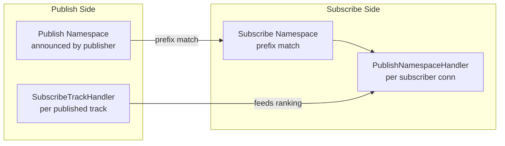
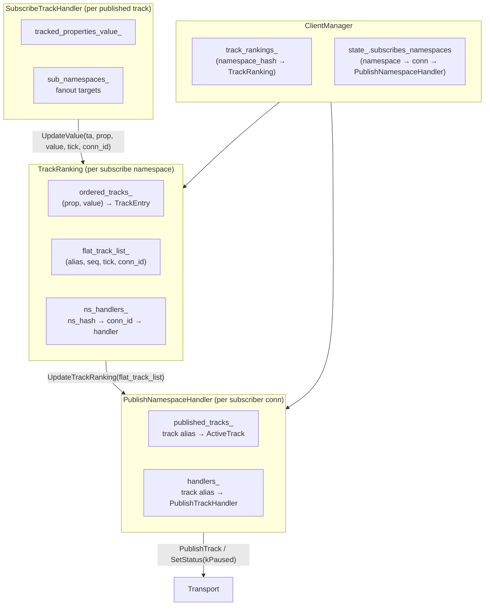
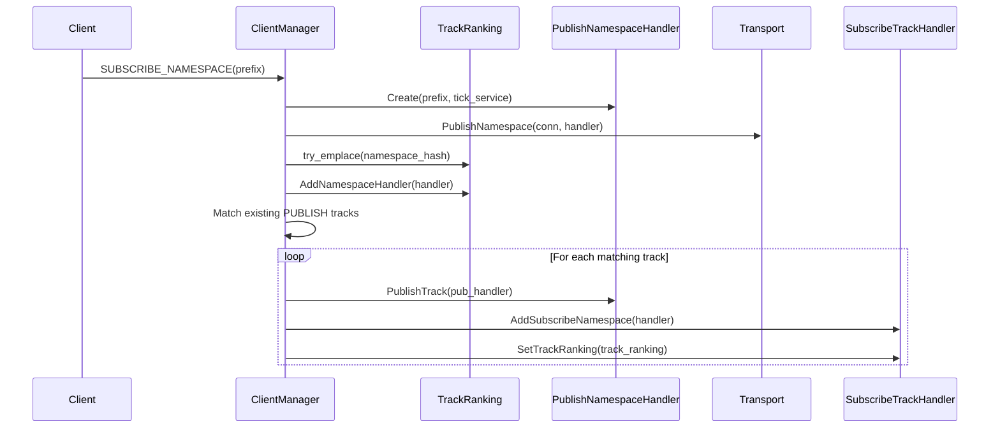
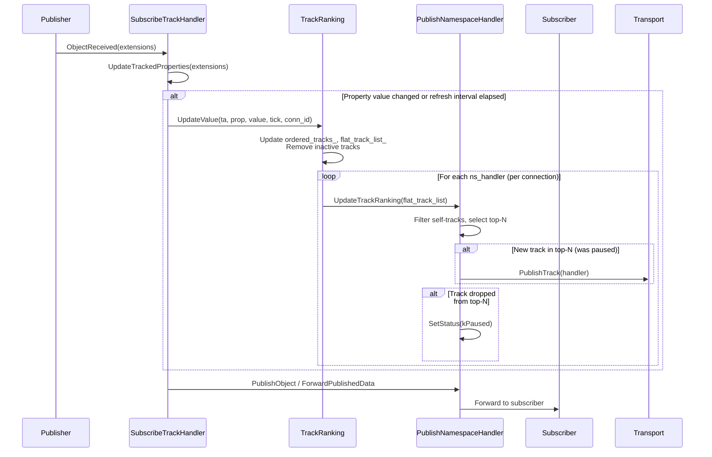
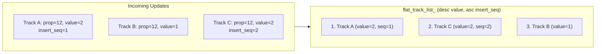
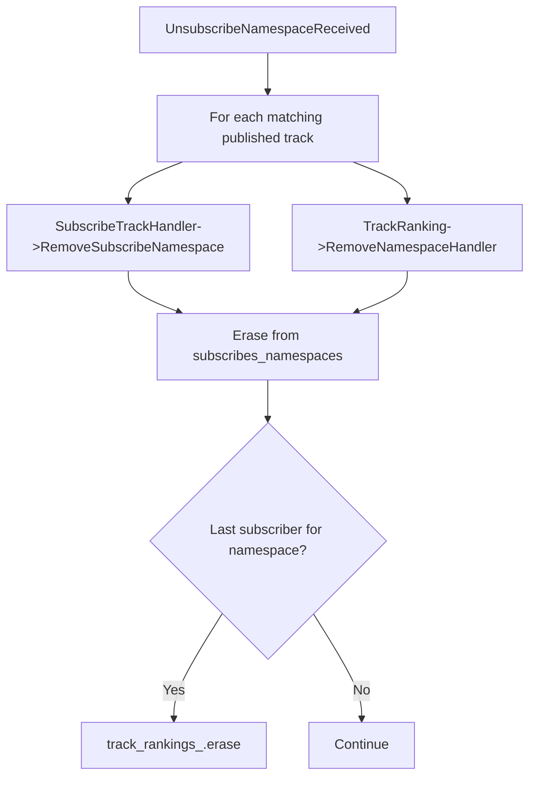
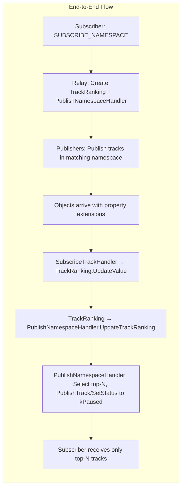

# Track Ranking with Subscribe and Publish Namespaces

This document describes how track ranking works in the LAPS relay, enabling **Top-N** selection when a subscriber uses a **subscribe namespace** to receive only the highest-ranked tracks from a set of publishers.

## Overview

When a client subscribes to a **namespace prefix** (e.g., `quicr://example.com/live/`) rather than a specific track, the relay may receive many published tracks that match that prefix. Track ranking allows the relay to select and forward only the **top N** tracks based on a configurable property (e.g., quality score, bitrate, viewer count) extracted from object extensions.


## Key Components

### Subscribe Namespace vs Publish Namespace

| Concept | Description |
|--------|-------------|
| **Subscribe Namespace** | A client subscribes to a namespace *prefix* (e.g., `quicr://example.com/live/`). The relay will forward matching tracks. One `PublishNamespaceHandler` is created per subscriber connection for this namespace. |
| **Publish Namespace** | Publishers announce tracks within namespaces. When a track's namespace matches a subscribe namespace prefix, the track is eligible for ranking and forwarding. |



### Component Roles

| Component | Responsibility |
|-----------|-----------------|
| **TrackRanking** | Aggregates property values from all matching tracks (with connection ID), maintains sorted order by (property_type, property_value), removes inactive tracks, and notifies `PublishNamespaceHandler` instances when the top-N list changes. |
| **PublishNamespaceHandler** | Receives the ranked track list, filters self-tracks, maintains `published_tracks_` (max N active), and promotes/demotes tracks via `PublishTrack` or `SetStatus(kPaused)`. |
| **SubscribeTrackHandler** | Receives objects from publishers, extracts property values from extensions, pushes updates to `TrackRanking` (including connection ID), and fans out objects to subscribe namespaces. |

## Architecture Diagram



## Data Flow: Subscribe Namespace Received

When a client sends `SUBSCRIBE_NAMESPACE` for a prefix, all matching published tracks are initially added to the handler via `PublishTrack`. Top-N selection occurs when `UpdateTrackRanking` runs (triggered by objects with property extensions).



## Data Flow: Object Received and Ranking Update

When a published track receives an object with extensions:



## Ranking Algorithm

### Data Structures

**TrackRanking** maintains:

- **ordered_tracks_**: `map<(PropertyType, PropertyValue), TrackEntry>`
  - Key: `(property_type, property_value)` — e.g., `(12, 2)` for property 12 with value 2
  - Value: `TrackEntry` = `map<TrackAlias, TrackTickInfo>` where `TrackTickInfo` has `insert_seq_num` (update order) and `latest_tick`
- **flat_track_list_**: Sorted list of `(TrackAlias, insert_seq_num, latest_tick, conn_id)` for the selected property
  - Sorted by: property value **descending** (via reverse map iteration), then **ascending** `insert_seq_num` (earlier updates rank higher), then **descending** `track_alias` (tie breaker)
- **track_connections_**: Maps each track alias to its publisher's connection ID (used for self-track filtering)
- **ns_handlers_**: `map<namespace_hash, map<connection_id, PublishNamespaceHandler>>` — multiple handlers per namespace (one per subscriber connection)

### Sort Order



Higher property values rank first. Within the same value bucket, tracks are sorted by ascending `insert_seq_num` (earlier updates rank higher), then descending `track_alias` as a tie breaker.

### Sequence Number Assignment

When a track's property value **increases** (moves to a higher-value bucket), it receives a new sequence number calculated as:
```
seq_num = (1ULL << 63) | update_value_seq_num
```

When a track's property value **decreases** (moves to a lower-value bucket), it receives an inverted sequence number calculated as:
```
seq_num = std::numeric_limits<uint64_t>::max() - update_value_seq_num
```

This ensures that when a track improves (increases value), it ranks at the **top** of the new value bucket (lower sequence number = better rank). Conversely, when a track decreases in value, it ranks at the **bottom** of its new bucket, making room for other tracks with better values to be selected.

### Top-N Selection

**PublishNamespaceHandler** keeps at most `max_tracks_selected_` (default 1) tracks active:

- When `UpdateTrackRanking` is called with the new `flat_track_list_`, it iterates the list and selects the first N entries
- **Self-track filtering**: Tracks where `publisher_conn_id == GetConnectionId()` are skipped — a subscriber does not receive their own published tracks
- Tracks must exist in `published_tracks_` (added via `PublishTrack`) before they can be selected
- New tracks entering the top-N (previously paused) trigger `PublishTrack`; demoted tracks are set to `Status::kPaused`

### Inactive Track Removal

**TrackRanking** removes stale tracks from `ordered_tracks_` during every `UpdateValue` call when `tick - latest_tick > inactive_age_ms_`. This prevents tracks that have stopped sending updates from occupying ranking slots.

Stale track removal iterates through all property value buckets and removes any track entries whose latest tick exceeds the configured age threshold. The entire `flat_track_list_` is then rebuilt if any removals occur.

## Lifecycle: Connection and Namespace Cleanup



## Configuration Parameters

| Parameter | Component | Default | Description |
|-----------|-----------|---------|-------------|
| `max_tracks_selected_` | PublishNamespaceHandler | 1 | Maximum number of tracks to forward per subscribe namespace |
| `max_tracks_selected_` | TrackRanking | 32 | Max tracks in candidate pool (used by ranking logic) |
| `inactive_age_ms_` | TrackRanking | 1500 | Age (ms) after which a track is removed from ranking |
| `inactive_age_ms_` | PublishNamespaceHandler | 3000 | Age (ms) for staleness checks |
| `delay_publish_done_ms_` | PublishNamespaceHandler | 900 | Grace period before unpublishing a demoted track |
| `kRefreshRankingIntervalMs` | SubscribeTrackHandler | 1000 | Minimum interval between ranking updates for the same track |

## Implementation Details

### TrackRanking::UpdateValue Flow

The `UpdateValue` method performs several steps in sequence:

1. **Increment sequence counter**: Increments `update_value_seq_num_` for globally unique ordering
2. **Check for bucket migration**: Scans existing property buckets to see if the track exists in a different value bucket
3. **Mark bucket changes**: If track exists in a different bucket, it's removed and `value_decreased` flag tracks whether value went down
4. **Assign sequence number**:
   - If value increased: `seq_num = (1ULL << 63) | update_value_seq_num_` (high bit set for new values)
   - If value decreased: `seq_num = std::numeric_limits<uint64_t>::max() - update_value_seq_num_` (inverted for demotion)
5. **Insert/update track**: Adds track to new value bucket or updates `latest_tick` if already present
6. **Store connection ID**: Records the publisher's connection ID for self-track filtering
7. **Remove inactive tracks**: Scans all buckets and removes tracks with `tick - latest_tick > inactive_age_ms_`
8. **Rebuild flat list**: If buckets changed, reconstructs `flat_track_list_` by iterating buckets in descending value order, then sorting by `insert_seq_num` (ascending) and `track_alias` (descending)
9. **Notify handlers**: Updates all active `PublishNamespaceHandler` instances with the new ranked list

### Weak Pointer Management

The `ns_handlers_` map stores `std::weak_ptr<PublishNamespaceHandler>` to allow handlers to be garbage collected when subscribers disconnect. During each update:
- Weak pointers are locked to check if the handler still exists
- Dead handlers are automatically erased from the map
- If all handlers for a namespace are removed, the namespace entry is deleted

## Implementation: flat_track_list_ Optimization

The `flat_track_list_` is built from `ordered_tracks_` to optimize lookups and top-N selection:

```cpp
// Iterate property value buckets in reverse order (highest value first)
for (auto it = std::make_reverse_iterator(last);
     it != std::make_reverse_iterator(first); ++it) {

    // For each value bucket, collect all tracks
    std::vector<std::tuple<TrackAlias, uint64_t, uint64_t, uint64_t>> sort_tracks;
    for (const auto& [ta, tick_info] : entry) {
        sort_tracks.emplace_back(
          ta, tick_info.insert_seq_num, tick_info.latest_tick, track_connections_[ta]);
    }

    // Sort by insert_seq_num (ascending), then track_alias (descending)
    std::ranges::sort(sort_tracks, [](const auto& a, const auto& b) {
        if (std::get<1>(a) != std::get<1>(b))
            return std::get<1>(a) < std::get<1>(b);
        return std::get<0>(a) > std::get<0>(b);
    });

    // Append sorted tracks to flat list
    flat_track_list_.insert(flat_track_list_.end(),
                            sort_tracks.begin(), sort_tracks.end());
}
```

This results in a flat list where tracks are naturally ordered by:
1. Property value (descending) — higher values first
2. Sequence number within value (ascending) — earlier/better updates first
3. Track alias (descending) — tie breaker

When `flat_track_list_` is not rebuilt (simple tick updates for existing tracks), it's updated in-place by scanning for the track and updating its `latest_tick` and `connection_id`.

## Summary



Track ranking enables efficient **Top-N** delivery: when many tracks match a subscribe namespace, the relay forwards only the top N by a chosen property, reducing bandwidth and focusing the subscriber on the most relevant streams.
