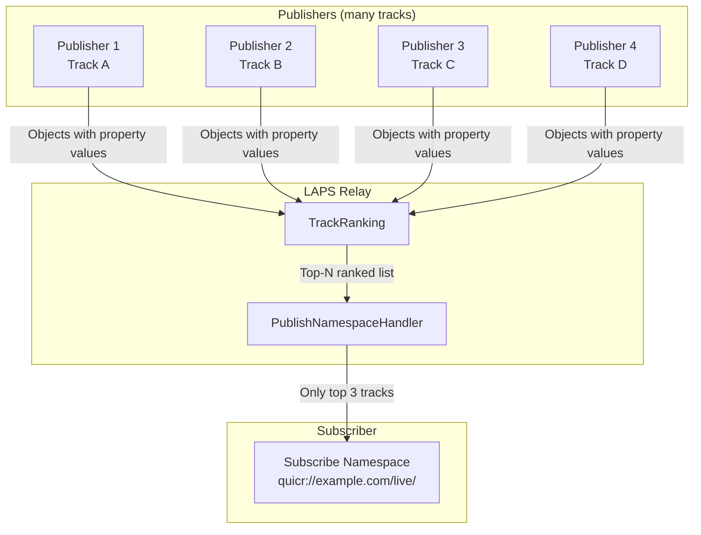
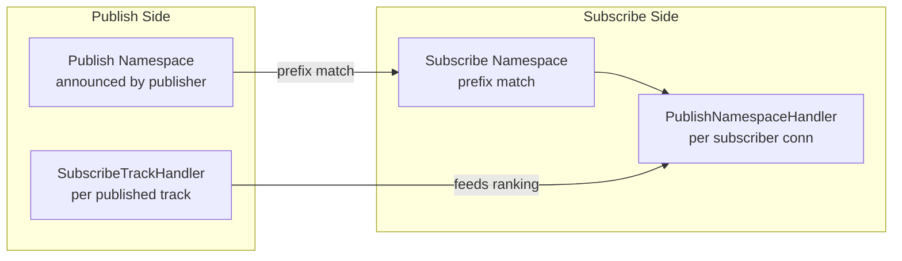
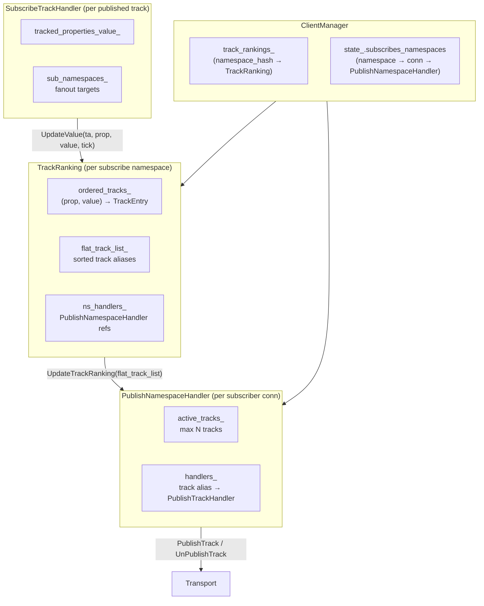
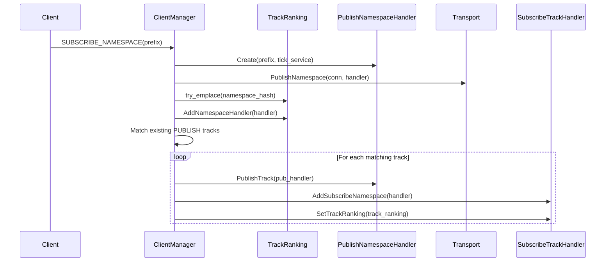
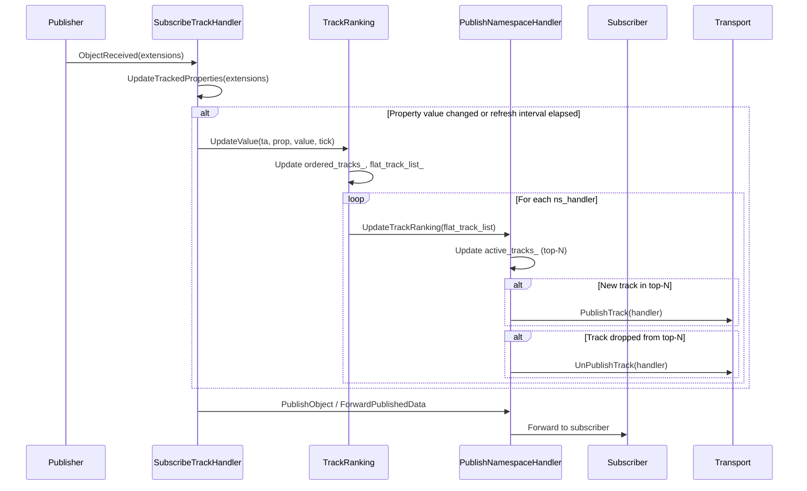
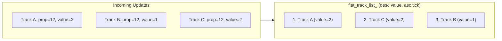
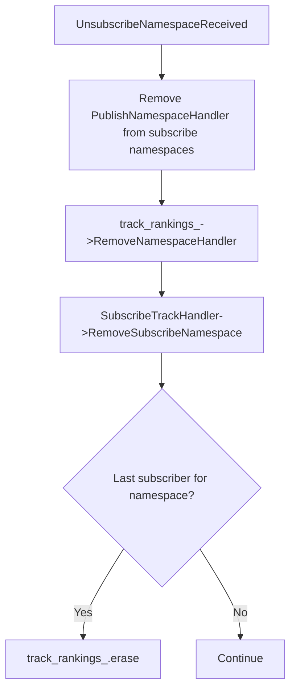
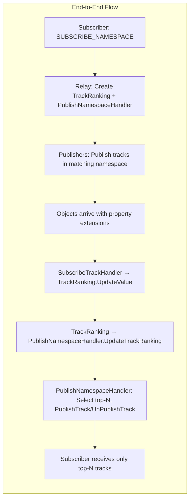

# Track Ranking with Subscribe and Publish Namespaces

This document describes how track ranking works in the LAPS relay, enabling **Top-N** selection when a subscriber uses a **subscribe namespace** to receive only the highest-ranked tracks from a set of publishers.

## Overview

When a client subscribes to a **namespace prefix** (e.g., `quicr://example.com/live/`) rather than a specific track, the relay may receive many published tracks that match that prefix. Track ranking allows the relay to select and forward only the **top N** tracks based on a configurable property (e.g., quality score, bitrate, viewer count) extracted from object extensions.

## Key Components

### Subscribe Namespace vs Publish Namespace

| Concept | Description |
|--------|-------------|
| **Subscribe Namespace** | A client subscribes to a namespace *prefix* (e.g., `quicr://example.com/live/`). The relay will forward matching tracks. One `PublishNamespaceHandler` is created per subscriber connection for this namespace. |
| **Publish Namespace** | Publishers announce tracks within namespaces. When a track's namespace matches a subscribe namespace prefix, the track is eligible for ranking and forwarding. |

### Component Roles

| Component | Responsibility |
|-----------|-----------------|
| **TrackRanking** | Aggregates property values from all matching tracks, maintains sorted order by (property_type, property_value), and notifies `PublishNamespaceHandler` instances when the top-N list changes. |
| **PublishNamespaceHandler** | Receives the ranked track list, maintains `active_tracks_` (max N tracks), and promotes/demotes tracks by calling `PublishTrack` / `UnPublishTrack` on the underlying transport. |
| **SubscribeTrackHandler** | Receives objects from publishers, extracts property values from extensions, pushes updates to `TrackRanking`, and fans out objects to subscribe namespaces. |

## Architecture Diagram

## Data Flow: Subscribe Namespace Received

When a client sends `SUBSCRIBE_NAMESPACE` for a prefix:

## Data Flow: Object Received and Ranking Update

When a published track receives an object with extensions:

## Ranking Algorithm

### Data Structures

**TrackRanking** maintains:

- **ordered_tracks_**: `map<(PropertyType, PropertyValue), TrackEntry>`
  - Key: `(property_type, property_value)` — e.g., `(12, 2)` for property 12 with value 2
  - Value: `TrackEntry` = `map<TrackAlias, tick>` — tracks in that bucket, with last update tick
- **flat_track_list_**: Sorted list of `(TrackAlias, tick)` for the selected property
  - Sorted by: property value **descending**, then tick **ascending** (newer updates rank higher within same value)

### Sort Order

Higher property values rank first. Within the same value, lower tick (older) comes first; the code uses reverse iteration so more recent ticks rank higher when values are equal.

### Top-N Selection

**PublishNamespaceHandler** keeps at most `max_tracks_selected_` (default 3) tracks active:

- When `UpdateTrackRanking` is called with the new `flat_track_list_`, it takes the first N entries
- Tracks not in the top-N are removed from `active_tracks_` after a grace period (`delay_publish_done_ms`)
- New tracks entering the top-N trigger `PublishTrack`; demoted tracks trigger `UnPublishTrack`

## Lifecycle: Connection and Namespace Cleanup

## Configuration Parameters

| Parameter | Component | Default | Description |
|-----------|-----------|---------|-------------|
| `max_tracks_selected_` | PublishNamespaceHandler | 3 | Maximum number of tracks to forward per subscribe namespace |
| `inactive_age_ms_` | Both | 3000 / 5000 | Age (ms) after which a track is considered stale |
| `delay_publish_done_ms` | PublishNamespaceHandler | 500 | Grace period before unpublishing a demoted track |
| `kRefreshRankingIntervalMs` | SubscribeTrackHandler | 1000 | Minimum interval between ranking updates for the same track |

## Property Extraction

The **SubscribeTrackHandler** tracks property values from object extensions:

- Properties are read from `object_headers.extensions` and `object_headers.immutable_extensions`
- Currently, property `12` is tracked (see `tracked_properties_value_.emplace(12, 0)` in constructor)
- Only even-numbered properties are updated (see `prop % 2 != 0` check)
- Updates are throttled by `kRefreshRankingIntervalMs` to avoid excessive ranking churn

## Summary

Track ranking enables efficient **Top-N** delivery: when many tracks match a subscribe namespace, the relay forwards only the top N by a chosen property, reducing bandwidth and focusing the subscriber on the most relevant streams.
